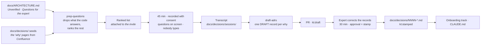

You are here if: an expert has a leaving date; or the map's "Questions for the expert" section is longer than the map; or you've run a "brain dump" session before and nobody has watched the recording.

This page serves the **Verify** stage of [the pipeline](/kt/overview/) and the third place knowledge lives: the heads. The code knows what the system does and the map now says so with citations. The documents know what someone once said. Only Priya knows *why* `MoneyMath` rounds half-even, and only Marcus knows what happened the night the batch ran twice — and neither of those facts is in any file, because nobody ever asked them in a form that produced one.

**The expert's hour is the scarcest resource in the building.** Priya and Marcus have about six spare hours a week between them, and every one of those hours is also the hour an incident gets fixed in. A forty-five-minute session per week from one of them is the entire budget for this stage, so the whole method is built to make those forty-five minutes produce something durable: **preparation is the whole trick — the expert spends the session answering questions the map couldn't, not describing things the map already knows.** The agent prepares the questions, the expert talks, the agent drafts the records, the expert corrects. Nobody types.



Seventy-five minutes of expert time per cycle. The rest is tokens.

## Where the questions come from

A good question for an expert has three parts: what the map claims, what the code shows, and the one thing only a human can settle. The map already wrote the first two. Every `ARCHITECTURE.md` produced by the `map-repo` skill ends with an "## Unverified" section (claims the agent couldn't cite) and a "## Questions for the expert" section (why, history, intent), and the [Confluence triage](/kt/confluence/) left the sixty "why" pages as seeds under `docs/decisions/`. The `prep-questions` step reads all of that and does two things a tired human wouldn't: it tries to answer each candidate from the code first, and drops the ones it can — those are doc fixes, not questions — then ranks what's left by what breaks if the map is wrong.

```text
# prompts/prep-questions.md — READ-ONLY. Run before every expert session; the output is the agenda.
You are preparing questions for a 45-minute session with ONE expert who has
about six spare hours a week. A question the code can answer is a question you
must not ask.

Inputs on disk:
- docs/ARCHITECTURE.md      read "## Unverified" and "## Questions for the expert" in full
- docs/decisions/           existing records; skip any whose status line says STAMPED
- docs/decisions/seeds/     "why" pages migrated from Confluence — intent with no code behind it
- docs/decisions/QUEUE.md   questions carried over from earlier sessions, if it exists
- docs/ESTATE.md            the main-dev column: who is the only person for what
- the code                  used to ELIMINATE questions, never to answer "why"

Do this, in order:
1. Collect every candidate question from the inputs; keep where each came from.
2. For each candidate, try to answer it from the code with Grep and Glob. If the
   code answers it, DROP it and list it under "Answered by the code" with the
   citation. That is a doc fix, not a question.
3. For what remains, write ONE question per line that the expert can answer in
   under five minutes. Attach: what the map says (path:line), what the code shows
   (path:line), and the one thing being asked. A question with no citation on
   either side goes to the bottom.
4. Rank by (a) what breaks if the map is wrong about this, (b) how many other
   claims in the map depend on it, (c) whether this expert is the ONLY person
   who can answer it — name the right person if it is someone else.
5. Stop at twelve. A session covers about seven; the rest are next week's agenda.

Never invent a class, method, table, queue, or endpoint name. Never ask a
question that a STAMPED record in docs/decisions/ already answers.

Output ONLY this markdown:

# Questions for <expert> — <date>
## Ask (ranked)
1. **<question>** — map says: <claim> (<path:line>) · code shows: <finding> (<path:line>) · asking: <the one thing> · depends: <n> claims · only <expert>? yes|no
## Answered by the code — drop these
- <question> → <path:line>
## Could not classify
- <question> — <why>
```

Run it in the repo the expert owns, read-only, the week before the session. The output goes into the calendar invite:

```bash
# seat: team
cd ~/ledger/ledger-core
claude -p "$(cat prompts/prep-questions.md)" \
  --permission-mode dontAsk \
  --allowedTools "Read,Grep,Glob" \
  --max-turns 40 \
  --max-budget-usd 3 \
  --model sonnet \
  --output-format json > prep-run.json
jq -r '.result' prep-run.json > docs/decisions/sessions/2026-09-12-priya-questions.md
jq '{num_turns, total_cost_usd, denials: (.permission_denials | length)}' prep-run.json
```

`--permission-mode dontAsk` with an explicit read-only allowlist is the locked-down shape for anything that runs without you watching the prompt; the flags themselves are [the Toolkit's](/toolkit/headless-and-sdk/). The `denials` count is the line to look at — it should be `0`, and if it isn't, the prompt asked for a tool the allowlist refused, which is a prompt bug, not a permissions problem. The result, for `ledger-core` before Priya's session:

```markdown
# Questions for Priya — 2026-09-12
## Ask (ranked)
1. **Why does `MoneyMath.round` use HALF_EVEN while the Oracle side rounds HALF_UP?** — map says: "all monetary rounding goes through MoneyMath.round" (docs/ARCHITECTURE.md:96) · code shows: `RoundingMode.HALF_EVEN` (ledger-shared/src/main/java/com/ledger/shared/MoneyMath.java:47) but `ROUND_HALF_UP` in the settlement package (ledger-db/legacy/DO_NOT_RUN/pkg_settle.sql:212) · asking: which is intended, and does the batch reconcile the difference · depends: 11 claims · only Priya? yes
2. **Why does `SettlementService` apply FX before fees, when the 2019 "Settlement Flow" page says after?** — map says: FX first (docs/ARCHITECTURE.md:142) · code shows: `applyFx` precedes `applyFees` (src/main/java/com/ledger/core/settle/SettlementService.java:203-211) · asking: did the order change in the 2022 MQ rework · depends: 6 claims · only Priya? yes
3. **What is `ledger-api`'s `legacy/` package still doing in the build?** — map says: "scheduled for deletion, no tests" (docs/ARCHITECTURE.md:230) · code shows: one live caller (ledger-api/src/main/java/com/ledger/api/web/ExportController.java:58) · asking: what breaks without it · depends: 2 claims · only Priya? no — Marcus (docs/ESTATE.md:14)
4. **Are the 40 `ledger-shared` classes with no callers found reachable by reflection?** — map says: "no callers found" (docs/ARCHITECTURE.md:288) · code shows: no `Class.forName` or component scan over `com.ledger.shared.util` (inference — searched, not proven) · asking: safe to delete, or on a path Grep can't see · depends: 1 claim · only Priya? no
## Answered by the code — drop these
- "Does ledger-api ever write to Oracle directly?" → no datasource is configured in ledger-api (ledger-api/src/main/resources/application.yml:31); the only one is in ledger-core (src/main/java/com/ledger/core/config/DataSourceConfig.java:22)
## Could not classify
- "Why was the Java 8 Maven profile kept?" — no main-dev for the build files in docs/ESTATE.md; ask whoever is in the room
```

Read the ranking before you trust it. Question 1 is on top because eleven claims depend on it and only Priya can answer. Question 3 correctly routes to Marcus — `ledger-api`'s `CLAUDE.md` already says he's the only person who knows why that package exists, so it shouldn't spend Priya's minute. "Answered by the code" is the quiet win: a meeting would have asked it; now it's a one-line doc fix before the session. And `(inference)` in question 4 is the agent saying it searched and didn't find, which is not proved absent — say so when you ask.

## The session format

Forty-five minutes. Not an hour, because an hour blocks the afternoon and a forty-five-minute slot with a hard stop is bookable next to anything. The shape:

| Minutes | What happens | Who talks |
|---|---|---|
| 0–3 | Consent, on the recording: "This is recorded and transcribed into the repo; you'll correct the records before they merge; say the word and anything comes out." | Dana |
| 3–40 | The ranked list on the shared screen, one question at a time. The expert answers; Dana asks exactly one follow-up per answer — *what breaks if we change it?* — and moves on. Nobody types. | The expert |
| 40–45 | "What did I not ask?" — and the last five minutes are for the failure story (below). | The expert |

Nobody types because typing turns the person taking notes into a bottleneck and the expert into a dictation machine; the recording is the notes. The questions are on screen because an expert who can see what's coming answers faster and stops expanding on things that aren't on the list. Stop at forty-five even mid-list: the remaining questions go to `docs/decisions/QUEUE.md` and lead next week's agenda. The transcript your meeting tool exports — with timestamps — is saved as `docs/decisions/sessions/2026-09-12-priya.txt` and committed with the records, because every record is about to point into it.

:::tip[Good citizen]
Book the session like you'd book a production change window: forty-five minutes, in the calendar a week ahead, the ranked list attached to the invite so Priya can glance at it over coffee and know exactly what she's walking into. One session per expert per week, at most — and book the thirty-minute review slot for the following week at the same time. Never "got five minutes?"; the unplanned five minutes costs the hour of concentration she was spending on the incident you don't know about yet. And if the map isn't stamped, don't book the session at all — the questions won't be real.
:::

## After the session: transcript to decision records

The transcript is forty-five minutes of speech: half sentences, corrections mid-thought, "no wait, that was the other batch." Nobody should read it twice, and the expert should never be asked to. The `draft-adrs` skill reads it once and produces one decision record per "why" the expert actually answered — ADR-lite, short enough that seven of them are a thirty-minute review. The skill lives at `.claude/skills/draft-adrs/SKILL.md`; how skills load and take arguments is on [the Toolkit page](/toolkit/skills/).

```markdown
---
name: draft-adrs
description: Turn one expert-session transcript into DRAFT decision records under docs/decisions/ — one record per "why" the expert actually answered, ADR-lite (context, decision, consequences, source with a timestamp). Never invents a decision the transcript does not contain.
disable-model-invocation: true
allowed-tools: Read Grep Glob Write
argument-hint: "[transcript-path] [expert] [session-date]"
---
You are turning an expert-session transcript into decision records. The
arguments, in order, are the transcript path, the expert's name, and the
session date: $ARGUMENTS. The transcript is speech — timestamps, half
sentences, corrections mid-thought. Find the decisions in it; do not tidy it.

Rules that override everything else:
1. One record per decision the expert ACTUALLY STATED. If they said "I don't
   remember" or "ask Marcus", there is no record: append the question to
   docs/decisions/QUEUE.md with who to ask, and move on.
2. Never invent a decision, a date, a reason, or a name. Where the reasoning is
   subtle, quote the expert's words inside the record instead of paraphrasing.
3. Every record starts `**Status: DRAFT — not yet corrected by <expert>.**` and
   ends with a Source line: `<expert>, <date> session, <hh:mm>` — the transcript
   timestamp where the answer begins — followed by the transcript citation
   `(docs/decisions/sessions/<file>:<line>-<line>)`.
4. Where docs/ARCHITECTURE.md already cites the code the decision is about, copy
   the citation into "## Evidence in code". Add no citation you have not verified
   with Grep in this checkout. Mark anything you inferred `(inference)`.
5. Number from the highest existing record in docs/decisions/ plus one; filename
   NNNN-<short-slug>.md; keep each record under 60 lines.
6. A failure story ("the time X happened") is also a record: same format, with a
   "## What happened" section — the expert's recollection, labelled as such —
   before "## Decision".

Format of every record:

# NNNN — <the decision in one line>
**Status: DRAFT — not yet corrected by <expert>.**
## Context
<why the question existed: what the map or the code showed>
## Decision
<what was decided and why, in the expert's words where it matters>
## Consequences
<what this constrains today; what breaks if it changes>
## Evidence in code
- `path:line` — <what is there>
## Source
<expert>, <date> session, <hh:mm> (docs/decisions/sessions/<file>:<line>-<line>)

Finish by listing the files written and the questions appended to QUEUE.md.
```

Run it the same afternoon, while the session is fresh enough that you'll notice a wrong record on sight:

```bash
# seat: team
cd ~/ledger/ledger-core
claude -p "/draft-adrs docs/decisions/sessions/2026-09-12-priya.txt Priya 2026-09-12" \
  --permission-mode acceptEdits \
  --allowedTools "Read,Grep,Glob,Write" \
  --max-turns 30 \
  --max-budget-usd 4 \
  --model sonnet \
  --output-format json > adrs-run.json
jq -r '.result' adrs-run.json
```

```console
$ jq -r '.result' adrs-run.json
Written:
  docs/decisions/0004-moneymath-rounding.md
  docs/decisions/0005-fx-before-fees.md
  docs/decisions/0006-shared-util-reflection-path.md
Appended to docs/decisions/QUEUE.md:
  - ledger-api legacy/ package: Priya deferred to Marcus (14:52)
  - Java 8 profile: "I think that was Tom's, ask the platform team" (15:01)
```

Three records from four questions, and two questions honestly carried forward rather than answered on the expert's behalf. The record for question 1 looks like this — note what's quoted, what's cited, and what's marked as the agent's own:

```markdown
# 0004 — MoneyMath rounds HALF_EVEN; the Oracle settlement package rounds HALF_UP, and the batch reconciles totals, not lines
**Status: DRAFT — not yet corrected by Priya.**
## Context
The map says all monetary rounding goes through `MoneyMath.round` (docs/ARCHITECTURE.md:96). The code shows `RoundingMode.HALF_EVEN` in Java (ledger-shared/src/main/java/com/ledger/shared/MoneyMath.java:47) and `ROUND_HALF_UP` in the PL/SQL settlement package (ledger-db/legacy/DO_NOT_RUN/pkg_settle.sql:212). Eleven claims in the map assume one policy.
## Decision
HALF_EVEN in Java is deliberate and matches the general-ledger export that finance reconciles against; it was chosen in 2014 when `MoneyMath` was written. The Oracle package predates it and was never changed. Priya: "The batch reconciles *totals* per business date, not lines. The per-line difference nets to under a cent per ten thousand lines and the reconciliation tolerance absorbs it. Changing the package would change historical totals, and nobody wants that conversation with finance."
## Consequences
- Both policies are intended; the map's "all rounding goes through MoneyMath" is wrong for the PL/SQL path and needs a correction (doc fix, not a code fix).
- Anyone moving settlement arithmetic from PL/SQL into Java must keep HALF_UP for that path or re-baseline the reconciliation tolerance (inference — Priya described the tolerance but not where it is configured; see QUEUE.md).
- The reconciliation tolerance is the real invariant; nothing in the map cites it.
## Evidence in code
- `ledger-shared/src/main/java/com/ledger/shared/MoneyMath.java:47` — `RoundingMode.HALF_EVEN`
- `ledger-db/legacy/DO_NOT_RUN/pkg_settle.sql:212` — `ROUND_HALF_UP`
## Source
Priya, 2026-09-12 session, 14:20 (docs/decisions/sessions/2026-09-12-priya.txt:88-131)
```

The Source line is the proof step for the whole page. It's a citation in the same `(path:line-line)` form the map uses, so the nightly freshness job in [Keeping It True](/kt/living-docs/) checks it like any other, and a reviewer who doubts a sentence can open the transcript at line 88 and hear it in Priya's words. The `(inference)` in Consequences is the agent drawing a line between what Priya said and what it concluded — the line the review is for.

### The expert corrects the records, not the transcript

Open one PR with the records and the transcript, labelled `kt:draft`, and request the expert's review with the thirty-minute slot already in their calendar:

```bash
# seat: team
git checkout -b kt/decisions-2026-09-12-priya
git add docs/decisions/
git commit -m "docs: DRAFT decision records 0004-0006 from Priya's 2026-09-12 session"
gh pr create --draft --label kt:draft --reviewer priya \
  --title "DRAFT decision records 0004–0006 — Priya, 2026-09-12 session" \
  --body "Three records drafted from the transcript by /draft-adrs. Review the records, not the transcript: correct in comments, approve when each says what you meant. Approval flips the status line and the label."
```

```console
$ gh pr create --draft --label kt:draft --reviewer priya ...
https://github.com/payments/ledger-core/pull/412
```

Priya reviews the records, never the transcript, because the records are three pages and the transcript is forty-five minutes she already lived through. Corrections are review comments; where she wants different words, she suggests them in the diff. Approval is the stamp: the status line changes to `**Status: STAMPED 2026-09-19 by Priya.**` in the same PR, the label flips to `kt:stamped`, and the map's own line 96 gets its correction in a follow-up commit citing record 0004. **The stamp is a git event — visible, dated, attributable, revocable — not a feeling that the meeting went well.** Thirty minutes, and the reason `MoneyMath` rounds the way it does now outlives Priya's tenure.

## Capturing failure stories

The last five minutes of every session are for a different kind of knowledge: the incident. "The time the batch ran twice" is not a decision anyone made; it's the reason a decision exists, and the constraint an engineer will break in five years if it's only in Marcus's head. These are written in the sister site's Field Notes shape — what happened, what we had wrong, what changed — folded into the record format so they live next to the decisions they produced:

```markdown
# 0007 — Settlement batch runs are idempotent by business date, because once they weren't
**Status: DRAFT — not yet corrected by Marcus.**
## What happened
Marcus's recollection, not a log — the 2019 run logs no longer exist. The 03:00 run stalled while writing `SETTLEMENT` rows; an operator restarted it from the ops console at about 03:20 while the first run was still committing. Both runs wrote. Roughly four thousand settlements posted twice; finance caught it in the morning reconciliation; two days to unwind.
## Context
Nothing in the batch checked whether a run for the same business date already existed. Marcus: "Restart was the standard fix for everything. It just had never been the fix while the first one was still alive."
## Decision
Every run acquires a row in `SETTLEMENT_RUN` keyed by business date before it writes anything; a second run for the same date exits with `ALREADY_RAN` instead of failing, so a restart is always safe.
## Consequences
- A restart never double-posts — and never *resumes*: a stalled run must be marked FAILED by hand before a retry will write. Marcus: "That's the trade, and I'd make it again."
- The lock lives in Oracle, not MQ; the 2022 MQ rework kept it on purpose.
- Anyone touching `SettlementJobListener` must keep the acquire-before-write order.
## Evidence in code
- `ledger-batch/src/main/java/com/ledger/batch/settle/SettlementJobListener.java:41` — acquires the run lock in `beforeJob`
- `ledger-db/legacy/DO_NOT_RUN/settle_run_lock.sql:1` — the `SETTLEMENT_RUN` table, 2019
## Source
Marcus, 2026-09-16 session, 14:41 (docs/decisions/sessions/2026-09-16-marcus.txt:210-268)
```

"Marcus's recollection, not a log" is doing the honest work: the timeline is memory, labelled as memory, and the code citations are the part that's checkable today. This is the record Sam reads before touching `ledger-batch` in [The First Two Weeks](/kt/onboarding-track/), and it's the one that will stop a future engineer from "simplifying" the lock.

## The async variant: mining the questions channel

Between sessions, questions still happen. The team's convention is that every "quick question for Marcus" goes to the `#ledger-questions` channel as a thread, never a DM — so the answer is visible, and so it can be harvested. Once a week an agent reads the channel's export and turns answered threads into `docs/FAQ.md` entries. How the week's messages reach a file is a Slack workspace-admin question this site doesn't teach; whether it's an export or a read-scoped bot token, the input to the agent is a text file, and that's where the recipe starts:

```text
# prompts/mine-questions.md — READ-ONLY. Input: the week's #ledger-questions export at docs/faq/inbox/<week>.txt
You are turning one week of the #ledger-questions channel into FAQ entries.

Rules that override everything else:
1. An entry exists ONLY when a thread contains an answer, and the entry names
   the answer's author and date exactly as the export shows them. An answer
   with no attributable author is not an entry.
2. Quote the answer; do not improve it. If the author cited code, keep the
   citation as (path:line). If not, end the entry with
   "(no citation in the thread — treat as inference until someone adds one)".
3. Threads with a question and no answer go to docs/decisions/QUEUE.md as a
   line: the question, who was asked, the date.
4. Never merge two people's answers into one. Never invent a name.

Output ONLY markdown entries in this form, one per answered thread, to be
appended to docs/FAQ.md:

### <question, in the asker's words, one line>
<the answer, quoted> — **<author>, <date>, #ledger-questions**
```

```bash
# seat: team — needs the week's channel export (a Slack workspace-admin question, not a Claude one)
cd ~/ledger/ledger-core
cat docs/faq/inbox/2026-W38.txt | claude -p "$(cat prompts/mine-questions.md)" \
  --permission-mode dontAsk \
  --allowedTools "Read,Grep,Glob" \
  --max-turns 20 \
  --max-budget-usd 2 \
  --model sonnet \
  --output-format json > faq-run.json
jq -r '.result' faq-run.json >> docs/FAQ.md
```

```markdown
### Why does the held-settlement rerun happen at 03:40 and not right after the main run?
"Because the FX feed republishes at 03:30 and half the holds are missing rates. Rerunning before that just re-holds them." — **Marcus, 2026-09-17, #ledger-questions** (no citation in the thread — treat as inference until someone adds one)
```

The rule that makes this worth anything is the name. An FAQ entry that says "someone said" carries no authority and will be ignored, correctly; one that says Marcus, on a date, in a channel anyone can search, is a claim with a source. It's still `DRAFT` in the site's sense until the weekly FAQ PR is approved — and because the author is a CODEOWNER on `docs/`, that approval is Marcus reading his own words for thirty seconds. The unanswered threads land in `QUEUE.md`, which is where next week's `prep-questions` run picks them up.

:::caution[Four ways to waste the scarcest hour]
- **The ninety-minute brain dump.** "Tell us everything about settlement." The expert talks for ninety minutes about the things *they* find interesting, which are the things they've already solved; someone types; the notes describe the 2019 design because that's the story they tell. Nothing is checkable, nothing is ranked, the recording is never watched. Unstructured time produces unstructured output — every time.
- **"Please review these forty pages."** A generated document with no diff and no citations, sent with "have a look when you get a chance." They won't, and they shouldn't. The unit of review is one record, one page, with a `Source` timestamp — thirty minutes for seven of them.
- **Interviewing before mapping.** Without the map's "Unverified" section the questions are "how does settlement work?", and you're back to the brain dump. Map first, so every question carries a citation the expert can confirm or refute in a sentence.
- **Recording without consent.** Beyond the obvious problem, an expert who discovers later that a half-remembered "I think we did that because…" is in git as a decision record will not sit for a second session. Ask on the recording; keep the answer as the transcript's first line; let them strike anything before the PR.
:::

## What seventy-five minutes buys

| | A meeting | This page |
|---|---|---|
| Expert time | 60–90 min, plus "can you read my notes?" | 45 min talking + 30 min correcting |
| What exists afterwards | Notes in someone's drive; a Confluence page dated today and wrong next year | 3–7 records in `docs/decisions/`, each with a `Source` timestamp and code citations, stamped by PR approval |
| Who can check it | Whoever was in the room | Anyone: open the transcript at the cited line, open the code at the cited line |
| What keeps it true | Nothing | The nightly citation check; the record is next to the code it explains |
| What you pay | An hour of goodwill | Tokens for two bounded runs, and the discipline to map first |

The trade is real: this method costs a stamped map before the first session, and it produces fewer words than a brain dump. It produces fewer words because most of the words in a brain dump were already in the code.

## Where next

- **Next in the journey:** [The First Two Weeks](/kt/onboarding-track/) — the records you just stamped become the "why" exercises in Sam's second day, and record 0007 is the first thing Sam reads before touching the batch.
- **The lateral jump:** [Confluence: Mining a Graveyard for the Living](/kt/confluence/) — the sixty "why" pages are the other half of the question list; if you haven't triaged them, your `docs/decisions/seeds/` is empty and the prep run has less to work with.
