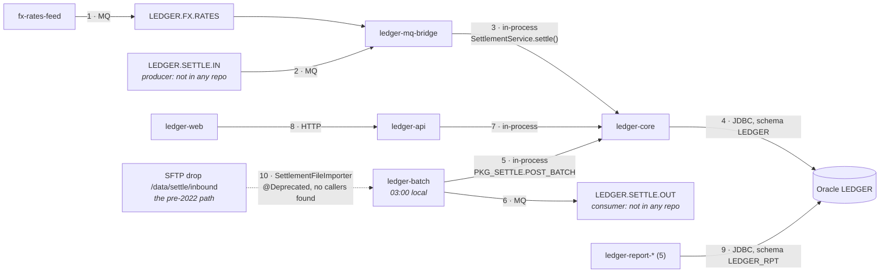

You are here if: the repos that matter each have a stamped `ARCHITECTURE.md` and nobody can still draw the call graph; or Sam asked what happens after a message lands on `LEDGER.SETTLE.IN` and got three different answers; or you're about to trust the "Settlement Flow" diagram because it's the only diagram there is.

## The system is the edges, not the nodes

A repo map answers eight questions about one node. It ends, honestly, where the repo ends: `ledger-core`'s map says `SettlementService.settle()` is a public bean whose callers are *in other repos — unverified*. `ledger-batch`'s map says it calls settlement at 03:00 and publishes to `LEDGER.SETTLE.OUT`, and stops. Neither knows that `ledger-mq-bridge` embeds `ledger-core` as a Maven dependency and calls the same method for every message on `LEDGER.SETTLE.IN`, in real time, since 2022. That fact lives in nobody's repo. It's an **edge**, and the system is the set of edges.

An edge has four parts, and the whole page is about producing them with evidence: **from → to → mechanism → evidence.** The mechanism is one of a short list — a Maven dependency, an in-process call, an MQ queue by name, HTTP, an Oracle schema by owner, a file drop, a cron. The evidence is two pointers, one at each end, into stamped maps. **An edge with evidence at one end is a hypothesis; the map lists it as one.** This is the Map stage at system level; it pulls the context lever (synthesis over twenty-three summaries, never over twenty-three repos) and the proof lever (a stamp, edge by edge, from the person who owns that edge).

## The workspace

Everything on this page runs from one directory, `~/ledger/`, where [Inventory the Estate](/kt/inventory-the-estate/) cloned all twenty-three repos. Give the system-level artifacts a repo of their own: `ledger-docs` has been empty since 2021, so clone it *as* `~/ledger/`, clone the other twenty-two inside it, and list them in its `.gitignore`. Now `SYSTEM.md`, the extracted dependencies, and the workspace `CLAUDE.md` are committed and reviewed like everything else:

```text
~/ledger/                        # the ledger-docs clone — the workspace IS a repo
├── CLAUDE.md                    # the workspace standing orders (below)
├── SYSTEM.md                    # the edges — the product of this page
├── deps/                        # extracted evidence: *.deps.json, queues.txt, schemas.txt
├── claims/                      # what the docs claim, for the contradiction audit
├── .claude/skills/system-map/SKILL.md
├── .gitignore                   # ledger-core/ ledger-batch/ … the 22 nested clones
├── ledger-core/                 # each with its own CLAUDE.md and docs/ARCHITECTURE.md
├── ledger-batch/
└── …
```

The workspace `CLAUDE.md` is an index. `@path` imports pull a file into the context, so the seven repos that matter get their standing orders imported and the sixteen small ones get a line:

```markdown
# Ledger — the workspace (~/ledger is the ledger-docs repo; the other 22 repos are cloned inside it)

## What this is
A 14-year-old billing and settlement platform: 23 repos, Oracle schema `LEDGER`,
IBM MQ queues `LEDGER.SETTLE.IN`, `LEDGER.SETTLE.OUT`, `LEDGER.FX.RATES`. The
system-level artifacts live here: SYSTEM.md (the edges), deps/ (extracted
dependencies), docs/CONFLUENCE-TRIAGE.md. Each repo's own map is in
<repo>/docs/ARCHITECTURE.md; its standing orders are in <repo>/CLAUDE.md.

## How to work here
- A name not found in one repo may be in another: say which one it is likely in
  (SYSTEM.md's edge table), search THERE, and cite `repo/path:line`.
- A cross-repo claim cites a line in a stamped map unless you searched the code
  yourself in this session.
- The seven repos that matter — standing orders imported:
  @ledger-core/CLAUDE.md
  @ledger-batch/CLAUDE.md
  @ledger-api/CLAUDE.md
  @ledger-web/CLAUDE.md
  @ledger-db/CLAUDE.md
  @ledger-mq-bridge/CLAUDE.md
  @ledger-shared/CLAUDE.md
- The other sixteen, listed only (their CLAUDE.md loads when you read files there):
  ledger-report-* (5), ledger-tools-* (6), fx-rates-feed, ledger-archiver,
  ledger-ops-scripts, ledger-migration-dotnet8, and this repo, ledger-docs.

## What not to do
- Do not describe an edge between repos without evidence at both ends.
- Do not treat Confluence space LEDGER as evidence; docs/CONFLUENCE-TRIAGE.md
  records which pages still match the code.
- Do not invent queue, schema, repo, or class names. "Unknown" is acceptable.
```

Two facts about loading decide how big this file may be, and both come from the memory hierarchy ([CLAUDE.md: The Standing Orders](/toolkit/claude-md/) owns it). First, `CLAUDE.md` files load from the root down through the parents to the current directory — so this index loads for *every* session in every nested repo, not just sessions started at the top. It's a prefix on every one of Sam's turns; keep it to a screen. Second, a subdirectory's `CLAUDE.md` loads lazily, when the session reads files in that directory — which is why the sixteen small repos are listed and not imported: their standing orders arrive the moment they're needed and cost nothing until then.

The seven imports are the deliberate cost. Seven short files is a few thousand tokens; but each of those files imports its repo's map, and as of September 2026 the documentation describes `@` imports without saying how deep they nest. Assume the maps come along, and check on the first session with `/context` — if seven maps are in the window, the index is costing you a few tens of thousands of tokens a turn (cache reads after the first, but a floor), and the trade below is live:

| Import the seven `CLAUDE.md` files | List them, import nothing |
|---|---|
| **You gain:** any cross-repo question starts with every neighbour's standing orders and, probably, every neighbour's map — no guessing which repo to search first | **You gain:** a workspace session that starts small and grows only as it reads; the same prefix cost for Sam in `ledger-core` as before the index existed |
| **You pay:** a prefix of up to seven maps on every turn of every nested session; check it with `/context` | **You pay:** the first turn of a cross-repo question is a search for which repo, and the model may guess |
| **Rule:** import while you are building `SYSTEM.md`; once it's stamped, the edge table answers "which repo" and the imports can go | |

## Dependency extraction, per language

The maps say what each repo *believes* about its neighbours. Before synthesizing, extract what the build files *know*, because a Maven dependency or a queue name in a config file is evidence the model didn't have to infer. Four extractions, all into `deps/`.

**Java — the build's own dependency tree**, as JSON (the dependency plugin has written JSON since 3.7; as of September 2026 it's at 3.11):

```bash
# seat: team
cd ~/ledger && mkdir -p deps
for r in ledger-core ledger-batch ledger-api ledger-mq-bridge ledger-shared fx-rates-feed ledger-archiver; do
  (cd "$r" && ./mvnw -q dependency:tree -DoutputType=json -DoutputFile="$HOME/ledger/deps/$r.deps.json")
done
jq -r '.. | objects | select(.groupId? == "com.ledger") | .artifactId' deps/ledger-mq-bridge.deps.json | sort -u
```

```console
$ jq -r '.. | objects | select(.groupId? == "com.ledger") | .artifactId' deps/ledger-mq-bridge.deps.json | sort -u
ledger-core
ledger-mq-bridge
ledger-shared
```

The middle line is the edge nobody could draw: `ledger-mq-bridge` embeds `ledger-core`, so the bridge-to-core mechanism is an in-process call, not a queue or an HTTP hop. (In a multi-module build the file is written per module; run it in the module that produces the deployable, or the last module wins.)

**.NET — `ledger-web` and the stalled migration.** The equivalent listing, transitive, as JSON (`dotnet package list` is the spelling on .NET 10):

```bash
# seat: team — needs the .NET SDK on this laptop; the listing reads the project file, it doesn't build the app
cd ~/ledger/ledger-web && dotnet list package --include-transitive --format json > "$HOME/ledger/deps/ledger-web.deps.json"
jq -r '.projects[].frameworks[].topLevelPackages[].id' "$HOME/ledger/deps/ledger-web.deps.json" | sort -u
```

```console
$ jq -r '.projects[].frameworks[].topLevelPackages[].id' "$HOME/ledger/deps/ledger-web.deps.json" | sort -u
Newtonsoft.Json
RestSharp
```

If the package list comes back empty, the project predates package references — `Glob` for `packages.config` and read that instead. Either way the fact you're after is a negative: no Oracle client, no MQ client. `ledger-web` talks to `ledger-api` over HTTP or it talks to nothing, whatever the 2019 diagram says.

**MQ — queue names, grepped from config and code**, never from documentation. Exclude `docs/` so the maps themselves can't count as evidence for what they claim:

```bash
# seat: team
cd ~/ledger
grep -rnE 'LEDGER\.(SETTLE|FX)\.[A-Z.]+' . --include='*.properties' --include='*.yml' --include='*.yaml' --include='*.xml' --include='*.config' --include='*.java' --include='*.cs' --include='*.sh' \
  | grep -v '/docs/' > deps/queues.txt
sed -E 's#^\./([^/]+)/.*#\1#' deps/queues.txt | sort | uniq -c | sort -rn
```

```console
$ sed -E 's#^\./([^/]+)/.*#\1#' deps/queues.txt | sort | uniq -c | sort -rn
      9 ledger-mq-bridge
      3 ledger-batch
      2 fx-rates-feed
      1 ledger-ops-scripts
```

Four repos know a queue name. `ledger-core` isn't one of them — consistent with its map — and `ledger-ops-scripts` is a surprise worth a line under Questions for the experts (a script that drains `LEDGER.SETTLE.OUT` by hand, it turns out).

**Oracle — schema owners from Liquibase**, and who touches each:

```bash
# seat: team
cd ~/ledger
grep -rhoE 'schemaName="[A-Z_]+"' ledger-db/db/changelog | sort | uniq -c | sort -rn | tee deps/schemas.txt
grep -rlE '\bLEDGER_RPT\.' . --include='*.java' --include='*.cs' --include='*.sql' --include='*.xml' | sed -E 's#^\./([^/]+)/.*#\1#' | sort -u
```

```console
$ grep -rhoE 'schemaName="[A-Z_]+"' ledger-db/db/changelog | sort | uniq -c | sort -rn | tee deps/schemas.txt
    412 schemaName="LEDGER"
     61 schemaName="LEDGER_RPT"
      8 schemaName="LEDGER_ARCH"
$ grep -rlE '\bLEDGER_RPT\.' . --include='*.java' --include='*.cs' --include='*.sql' --include='*.xml' | sed -E 's#^\./([^/]+)/.*#\1#' | sort -u
ledger-report-daily
ledger-report-fx
ledger-report-recon
```

Three schemas, and the reporting schema is touched only by the reporting repos — an edge with evidence at both ends before the model has read a word. Commit `deps/` with the run date in the commit message; the extraction is re-run when the maps are.

## The system-map skill

The synthesis is one skill, and its first rule is the one that keeps it cheap and checkable: **it reads maps and extracted evidence, never code.** A map line is already a cited, stamped claim; the edge's evidence points at the map line, and the map's own citation reaches the code. Two hops, both checkable.

```markdown
---
name: system-map
description: Synthesize SYSTEM.md for the ~/ledger workspace from every repo's docs/ARCHITECTURE.md and the extracted evidence in deps/ — never from raw code. Produces the node table, the edge table (from → to → mechanism → evidence), a Mermaid diagram of settlement, contradictions, and questions for the experts. Use when asked how the repos fit together.
disable-model-invocation: true
allowed-tools: Read Glob Grep Write
---
You are drawing the system for a senior engineer who has read one repo's map and
needs to know what calls it and what it calls. Write `SYSTEM.md` at the workspace
root. Its first line is `**Status: DRAFT — no edge has been stamped.**`

Rules that override everything else:
1. Read ONLY `*/docs/ARCHITECTURE.md` and `deps/*`. Never open `src/`, `pom.xml`,
   or anything under a repo other than its docs/. A repo with no map is a node
   with no edges and a line under "## Unmapped".
2. An edge is: from → to → mechanism → evidence. Mechanism is one of: maven-dep,
   in-process call, MQ queue <name>, HTTP, Oracle schema <owner>, file drop, cron.
   Evidence is `<repo>/docs/ARCHITECTURE.md:<line>` or `deps/<file>:<line>`. An
   edge with evidence at only one end carries the flag `one-sided`.
3. If a map's first line says DRAFT, every edge taken from it carries `(draft)`.
4. Never invent a queue, schema, repo, or class name. When two maps disagree,
   that is a row under "## Contradictions", not a choice.
5. Do not read claims/ or docs/CONFLUENCE-TRIAGE.md; the claims audit is a
   separate step a human runs against this file.

Produce, in this order:
1. "## Nodes" — a table: repo, one line of what it is (from its map), map status
   (STAMPED <date> by <name> | DRAFT | missing).
2. "## Edges" — one row per edge, numbered, sorted by from-repo.
3. "## Settlement, as it is" — a Mermaid flowchart of the settlement path only:
   the queues, the bridge, core, Oracle, the batch, the API, the web UI, the FX
   feed. Under 15 nodes. Every arrow is a numbered row in the edge table.
4. "## Contradictions" — rows where maps disagree or evidence is one-sided.
5. "## Unmapped" and "## Unverified".
6. "## Questions for the experts" — grouped: MQ, Oracle, and the batch for
   Marcus; settlement and rounding for Priya.

Keep it under 300 lines. The edge table is the product; the diagram is a view of it.
```

Run it from the workspace root with the stronger model, and read the run's JSON before the document:

```bash
# seat: team
cd ~/ledger
claude -p "/system-map" \
  --permission-mode acceptEdits \
  --allowedTools "Read,Glob,Grep,Write" \
  --model opus \
  --max-turns 40 \
  --max-budget-usd 12 \
  --output-format json > system-run.json
jq '{num_turns, total_cost_usd, is_error, denials: (.permission_denials | length)}' system-run.json
grep -nE '\(([a-z0-9-]+/)?src/' SYSTEM.md || echo "no citation into src/ — the skill read maps, not code"
```

```console
$ jq '{num_turns, total_cost_usd, is_error, denials: (.permission_denials | length)}' system-run.json
{
  "num_turns": 19,
  "total_cost_usd": 2.87,
  "is_error": false,
  "denials": 0
}
$ grep -nE '\(([a-z0-9-]+/)?src/' SYSTEM.md || echo "no citation into src/ — the skill read maps, not code"
no citation into src/ — the skill read maps, not code
```

The `grep` is the proof step for rule 1. "Never open `src/`" in the skill is a request; a citation into `src/` in the output would be the evidence it was ignored, and the check takes one second. Nineteen turns for twenty-three repos is the shape you should expect: the skill isn't searching, it's reading a known list of files and writing one.

## The integration map, as it is

This is the diagram the skill produced for settlement, with one edge the maps flagged and Marcus later confirmed. It's the flow *as it is*, and the dotted edge is the reason the Confluence page has been wrong since 2022:



Every arrow is a numbered row in the edge table, and the table is what gets reviewed. An excerpt, as generated:

```markdown
## Edges (excerpt)
| # | From | To | Mechanism | Evidence |
|---|---|---|---|---|
| 2 | (external) | ledger-mq-bridge | MQ queue LEDGER.SETTLE.IN | ledger-mq-bridge/docs/ARCHITECTURE.md:41 · deps/queues.txt:3 — producer not in any repo: one-sided |
| 3 | ledger-mq-bridge | ledger-core | in-process call (maven-dep ledger-core) | ledger-mq-bridge/docs/ARCHITECTURE.md:88 · deps/ledger-mq-bridge.deps.json:27 · ledger-core/docs/ARCHITECTURE.md:37 |
| 5 | ledger-batch | ledger-core | in-process call, cron 03:00 local | ledger-batch/docs/ARCHITECTURE.md:29 · ledger-batch/docs/ARCHITECTURE.md:71 |
| 8 | ledger-web | ledger-api | HTTP | ledger-web/docs/ARCHITECTURE.md:63 (draft) · ledger-api/docs/ARCHITECTURE.md:22 |
| 10 | (file drop) | ledger-batch | file drop /data/settle/inbound — SettlementFileImporter is @Deprecated; no callers found | ledger-batch/docs/ARCHITECTURE.md:118 — one-sided |
```

Read row 3 the way Priya will: the bridge's map, line 88, says its listener calls `SettlementService.settle()`; the bridge's dependency tree, line 27, shows `ledger-core` as a compile dependency; `ledger-core`'s map, line 37, is the public-bean row from its entry-point table. Three pointers, three files, twenty seconds each. Row 8 carries `(draft)` because nobody has stamped the .NET map — a finding about the estate, not about the edge. Row 10 is the 2019 flow: present in code, deprecated, no callers found — a finding, not "dead", and a question for Marcus.

:::note[What the model sees]
The workspace `CLAUDE.md` (and whatever it imports), the skill, twenty-three `ARCHITECTURE.md` files, and the four extraction outputs. No `src/`, no `pom.xml`, no Confluence. If a map is wrong, `SYSTEM.md` is wrong the same way — which is why the maps are stamped first and the system map cites their lines.
:::

## The runtime view

The static map says what *can* call what. Logs and traces say what *did*, last night, and the two disagree in ways that matter: an edge that exists in code and carried no messages for a month is a question for Marcus, not a fact for Sam. Two cheap runtime checks belong next to the edge table — the message counts per queue over a week (ask Marcus for the queue statistics, not for MQ access), and the application logs where a correlation ID crosses from the bridge into core. Not everything in Ledger runs where you can see it — `ledger-web` runs on Windows hosts, the batch on a VM — so the runtime view is partial, and `SYSTEM.md` says which edges it confirmed. The mechanics of logs and traces on the cluster are the sister site's: [Observability overview](https://jamiegunn.github.io/k8s_soup_to_nuts/observability/overview/).

## Why `opus` here, and why it's still cheap

Every repo map runs on `sonnet` because search-and-cite is what the default model is for. The system map is different work: hold twenty-three documents at once and notice that the batch's map says one thing about `LEDGER.SETTLE.OUT` and an ops script implies another. That's synthesis, and it's the one place in this section where the stronger model earns its rate.

It's cheap because of what it reads. Twenty-three maps at most 400 lines each is under ten thousand lines — call it 370,000 characters, about 90,000 tokens, read once — plus the `deps/` files. No search over code, no subagents, under twenty turns. The repo map's cost came from *searching*; this pass has nothing to search. The run above cost less than the `sonnet` map of `ledger-core` did, and the budget from the [site's table](/kt/measurement-and-governance/) — `--max-budget-usd 12`, forty turns — is a ceiling you shouldn't get near. The trade: `sonnet` would produce the same table with more one-sided rows the reviewer has to resolve; `opus` resolves more of them from the evidence and leaves better questions.

## The contradiction audit

Now the edges the *documents* claim, against the edges the code shows. For this page the claims come from the one page everyone links — copy the "Settlement Flow" diagram's arrows by hand into `claims/settlement-flow-2019.md`, six lines; [the Confluence page](/kt/confluence/) automates this for all 940. Then a session with `SYSTEM.md` and the claims file open produces the audit:

| Confluence "Settlement Flow" (2019) claims | The code shows | Evidence | Verdict |
|---|---|---|---|
| Settlement files arrive by SFTP; `ledger-batch` imports and posts them at 03:00 | Requests arrive on `LEDGER.SETTLE.IN`; the bridge posts them in real time; the batch nets and closes at 03:00 | edges 2, 3, 5; `SettlementFileImporter` `@Deprecated`, no callers found (edge 10) | CONTRADICTS — the 2022 MQ rework |
| `ledger-web` writes settlements to Oracle directly | `ledger-web` has no Oracle client; it calls `ledger-api` over HTTP | `deps/ledger-web.deps.json`; edge 8 | CONTRADICTS |
| FX rates are loaded nightly by the batch from a file | `fx-rates-feed` publishes to `LEDGER.FX.RATES`; the bridge updates `FxRateCache` in core; the batch still reads the `FX_RATE` table for netting | edges 1, 4; `ledger-core/docs/ARCHITECTURE.md:141` | CONTRADICTS in part — the table read is still true |
| Reports read from the `LEDGER_RPT` schema | Five `ledger-report-*` repos, all against `LEDGER_RPT` | edge 9; `deps/schemas.txt:2` | MATCHES |

Three of four wrong, one partly, and none of it the page author's fault — the page was true in 2019 and has no date on its claims. Each CONTRADICTS row does two things: it becomes a line in the Confluence triage, and, where the *why* is unknown (why was the SFTP path kept? is anything still using it?), a question for the experts.

## The stamp, edge by edge

`SYSTEM.md` is a `DRAFT` until the people who own the edges have stamped them, and no one person owns all of them. Open the PR in `ledger-docs` with the label and *two* reviewers, and use the PR body to assign rows: Marcus takes the MQ, Oracle, and batch edges (1, 2, 4, 6, 9, 10), Priya the settlement path (3, 5, 7, 8). Thirty minutes each, on the evidence column — open the map lines, not the prose.

```bash
# seat: team
cd ~/ledger
git switch -c kt/system-map
git add CLAUDE.md SYSTEM.md deps/ claims/ .claude/skills/system-map/SKILL.md .github/CODEOWNERS
git commit -m "docs: DRAFT system map — 10 settlement edges, 4 contradictions with the 2019 page, every edge cited to a stamped map"
git push -u origin kt/system-map
gh pr create --draft --label kt:draft --reviewer marcus-payments,priya-payments \
  --title "DRAFT: SYSTEM.md — Marcus: edges 1,2,4,6,9,10 · Priya: edges 3,5,7,8 · 30 min each" \
  --body-file .github/kt-review-gate.md
```

```console
$ gh pr create --draft --label kt:draft --reviewer marcus-payments,priya-payments --title "…" --body-file .github/kt-review-gate.md
Creating draft pull request for kt/system-map into main in payments/ledger-docs

https://github.com/payments/ledger-docs/pull/7
```

The [review gate](/kt/mapping-a-repo/#the-review-gate) checklist applies unchanged, with one addition for a system map: a one-sided edge stays one-sided unless the reviewer *names* the other end — "the producer on `LEDGER.SETTLE.IN` is the card-acquirer gateway, not in our GitHub org" is a correction that turns a hypothesis into an edge with a source. When both approve, the status line records who stamped what — `**Status: STAMPED 2026-09-19 — edges 1,2,4,6,9,10 by Marcus; 3,5,7,8 by Priya (PR #7).**` — the label flips to `kt:stamped`, and `.github/CODEOWNERS` in `ledger-docs` carries `/SYSTEM.md @marcus-payments @priya-payments` so the next edit asks them again.

:::tip[Good citizen]
Ten edges is a thirty-minute review. A system map with sixty rows, one per Maven dependency, is not more complete; it's the `MoneyMath` problem at estate scale — nobody will finish it. Keep the edge table to the mechanisms that cross a process boundary or a schema, put pure library dependencies in `deps/` where a script can read them, and split the review by owner, never by extending the time box.
:::

## Where next

- **Next in the journey:** [Confluence: Mining a Graveyard for the Living](/kt/confluence/) — the contradiction audit did one page by hand. There are 939 more, and the triage skill does what this page did: freshness first, then "does the code agree", page by page.
- **The lateral jump:** the same `dependency:tree` and `dotnet list package` output feeds the night's dependency triage — [The Night Reviews the Day](/overnight-qa/review-and-security/) turns a CVE list into an impact paragraph with a `path:line` to the call site.
