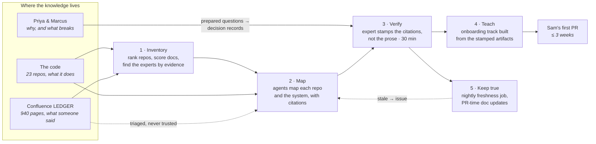

This section teaches you to move what your organization knows about a large, old system — the part that lives in the code, the part that lives in the documents, and the part that lives in two people's heads — into something a new developer can *query*, an expert can *verify in thirty minutes*, and CI can *keep true*. It assumes *this* kind of estate: many repos, a decade or more of history, a Confluence space nobody trusts, dependencies (Oracle, IBM MQ) that live outside the code, two long-tenured engineers who are the real architecture, and a new hire who starts Monday. If that sentence describes your quarter, you're in the right place.

**Find your way in.** Nobody reads a playbook cover to cover:

| You are… | Start at |
|---|---|
| Facing a specific problem ("Sam starts Monday and we have nothing") | [Start From Your Situation](/kt/scenarios/) |
| Told to "do something about onboarding" by end of month | [The 90-Minute Repo Map](/kt/quick-start/) |
| Wondering whether the code is even allowed to leave the building | [Working Within Policy](/start/working-within-policy/) |
| Staring at twenty-three repos with no idea which matters | [Inventory the Estate](/kt/inventory-the-estate/) |
| Watching your best engineer's retirement date approach | [Getting It Out of Their Heads](/kt/expert-interviews/) |
| The new hire, reading this on day one | [The First Two Weeks](/kt/onboarding-track/) |
| Reviewing a team's first AI-generated architecture doc | [The review gate](/kt/mapping-a-repo/#the-review-gate) |
| Just here for the tables, prompts, and checklists | [KT on One Page](/kt/cheat-sheet/) |

Everyone else: read on. This page explains knowledge transfer from zero and maps the rest.

## What knowledge transfer actually is

Strip away the program-management language and it's this: **a system's knowledge lives in three places, and a new engineer needs all three to be useful.**

1. **The code** knows what the system *does*. It is complete and current and it is 410,000 lines long in one repo alone, which is why nobody reads it.
2. **The documents** know what someone once *said* it does. They are readable and they are from 2019, which is why nobody trusts them.
3. **The heads** know *why* it does it that way and what would break if you changed it. They are correct and they are two people with six spare hours a week between them, which is why every question waits.

Traditional knowledge transfer tries to move the third into the second by scheduling meetings: the expert talks, someone types, a page appears in Confluence, and it's out of date the following quarter. It fails on arithmetic. The knowledge is large, the experts' time is small, and writing is slow. AI changes exactly one term in that arithmetic — writing the first draft becomes nearly free — and *only* that term. The expert's time stays small. The knowledge stays large. So the whole method on this site is built around one question: **does this technique turn one expert hour into more durable, verified knowledge than that hour would have produced in a meeting?** If not, don't do it.

## Why it's harder here than in the demo

Every "document your codebase with AI" demo carries three silent assumptions: one repo, current docs, and nobody who'll be blamed when the generated doc is wrong. None of them hold for you.

**The system is twenty-three repos, and the interesting part is the edges.** `ledger-core` doesn't know that `ledger-batch` calls it at 03:00 or that `ledger-mq-bridge` feeds it from `LEDGER.SETTLE.IN`; those facts live in config files, queue names, and Priya. A repo map is necessary and it is not the system. The system is the integration map, and no single session can hold twenty-three repos in its context window — which is why the method fans out with subagents per repo and synthesizes from *maps*, never from raw code ([Mapping the System](/kt/mapping-the-system/)).

**The documents are wrong in a specific, dangerous way: they're undated.** The "Settlement Flow" page in Confluence space `LEDGER` is the one everyone links. It was correct in 2019. It has described a flow that doesn't exist since the 2022 MQ rework, and a model that reads it will describe that flow back to you fluently and with confidence. The Field Note [The Architecture Doc That Was Confidently Wrong](/blog/the-architecture-doc-that-was-confidently-wrong/) is exactly this. The method's answer is a rule, not a hope: **the code is the source of truth, every claim cites `path:line`, and a document with no citation is labelled as inference** ([Confluence](/kt/confluence/)).

**Somebody will be blamed.** When Sam ships a change based on the generated map and the settlement batch double-posts, "the AI wrote the doc" is not an answer anyone will accept. So no generated document on this site is *done* until a named expert has stamped it — and the stamp is a git event (a PR approval that flips `kt:draft` to `kt:stamped`), not a feeling ([the review gate](/kt/mapping-a-repo/#the-review-gate)).

**And the history lies.** The estate moved from Bitbucket to GitHub in 2021 with squashed history, so `git blame` attributes everything older to one migration commit. Bus-factor analysis on this estate has to be dated, and the page that does it says so ([Inventory the Estate](/kt/inventory-the-estate/)).

Here's the whole pipeline, with the three sources drawn in:

Each box is a page: [Inventory the Estate](/kt/inventory-the-estate/), then [Mapping One Repo](/kt/mapping-a-repo/) and [Mapping the System](/kt/mapping-the-system/), [Confluence](/kt/confluence/) for the dotted line, [Getting It Out of Their Heads](/kt/expert-interviews/) for the heads, [The First Two Weeks](/kt/onboarding-track/) for teaching, and [Keeping It True](/kt/living-docs/) for the loop back.

## The maturity ladder

You do not need all of this at once. Each level is a fine place to stop and live for a quarter:

| Level | What it looks like | You are here if… | The pages |
|---|---|---|---|
| **0 — Shadowing** | New hires pair with Priya; questions go to Marcus; Confluence is where docs go to die | Every team starts here; nothing is wrong yet, except the calendar | — |
| **1 — One verified map** | The repo new hires touch first has an `ARCHITECTURE.md` with citations, stamped by an expert, and a `CLAUDE.md` that loads it | You need one real artifact this month | [Quick start](/kt/quick-start/) |
| **2 — The estate is mapped** | Every critical repo mapped; the system's edges drawn and stamped; Confluence triaged into true / wrong / "why" | Sam can find things but not understand *why* they're that way | [Inventory](/kt/inventory-the-estate/), [Repo](/kt/mapping-a-repo/), [System](/kt/mapping-the-system/), [Confluence](/kt/confluence/) |
| **3 — The heads are on paper** | Expert sessions run from prepared questions; decisions recorded as ADRs the expert corrected; an onboarding track built from the artifacts; new hires' sessions loaded with the map and told to cite or say "ask a human" | You run more than one new hire a year, or an expert has a leaving date | [Interviews](/kt/expert-interviews/), [Onboarding track](/kt/onboarding-track/) |
| **4 — Living** | A nightly job checks every citation still holds; PRs that touch cited code get a proposed doc edit; bus factor and freshness are tracked; the method is a shared skill five teams use | You're the person rolling this out beyond your team | [Keeping It True](/kt/living-docs/), [Measurement & Governance](/kt/measurement-and-governance/) |

The next step is always one level up, never a leap to the top.

## The four questions before any KT work

Every page in this section is ultimately serving one of these. Ask them in order, for every artifact you're about to generate:

1. **Where does this knowledge live?** Code, documents, or heads — and if it's heads, whose. The extraction technique is different for each, and using the wrong one wastes the scarce resource. → [Inventory the Estate](/kt/inventory-the-estate/)
2. **Who can verify it, and how long will that take them?** If the honest answer is "Priya, and two hours", the artifact is too big. Break it until the stamp fits in thirty minutes. → [The review gate](/kt/mapping-a-repo/#the-review-gate)
3. **Where will it be kept?** The repo, as markdown next to the code it describes — never only in a chat transcript, never only in Confluence. → [Mapping One Repo](/kt/mapping-a-repo/#output-layout)
4. **How will we know it's still true next quarter?** If the answer is "someone will notice", it will rot like the last one did. → [Keeping It True](/kt/living-docs/)

## The citizenship contract

One idea underpins the whole section, so it's stated once, here:

**The expert's hour is the scarcest resource in the building. Spend tokens to save expert hours — never the reverse.** Priya and Marcus have, between them, about six spare hours a week, and every one of those hours is also the hour in which a production incident gets fixed. A technique that generates forty pages and asks Priya to "have a look" has spent tokens *and* an expert hour and produced nothing durable, because she won't finish reading it and shouldn't. So the contract is:

- **The AI writes every first draft; the expert only ever corrects.** No expert on this site is asked to write a document, describe a flow, or fill in a template. They read a draft with pointers into the code and mark what's wrong.
- **Every claim carries a `path:line` citation**, so the expert reviews evidence, not prose. Checking "does `FxApplier.java:88` do what this sentence says" takes twenty seconds; checking "is this paragraph about FX conversion true" takes a re-read of the module.
- **Every artifact is `DRAFT` until a named expert stamps it**, and the stamp is a PR approval — visible, dated, attributable, and revocable.
- **The unit of review fits in thirty minutes.** A repo map is reviewed one section at a time; a system map is reviewed edge by edge; decision records are reviewed one per "why".

The recurring `:::tip[Good citizen]` aside appears wherever a technique could burn an expert's hour instead of saving it.

## Who owns what

The recurring boundary table, at section level. Details vary per page, but the shape never does:

| Concern | PLATFORM / SECURITY | YOU (the delivery team) |
|---|---|---|
| Whether this estate's source may be sent to the approved deployment | ✔ security's policy | ask, with the repo list; never assume |
| The credential Claude Code uses on laptops and in CI | ✔ issues it | use it; never paste it into a prompt or a doc |
| Allowlisting the Atlassian MCP server (or hosting the Data Center one) | ✔ managed settings | name the endpoint and the spaces you need |
| Which Confluence spaces are `restricted` | ✔ security | honour the filter in every recipe |
| Shared skills/plugins across teams | ✔ marketplace | author the `map-repo` skill; offer it |
| `CLAUDE.md`, `ARCHITECTURE.md`, `docs/decisions/` in your repos | | ✔ yours, reviewed like code |
| The expert's thirty minutes, booked and protected | | ✔ your calendar problem, not theirs |
| The onboarding track and the new hire's first ticket | | ✔ yours |
| The nightly freshness job and its issues | | ✔ yours (it's an overnight job — [that playbook](/overnight-qa/overview/) governs it) |
| Bus factor, freshness, time-to-first-PR — measured and reported | | ✔ yours, honestly |

If a checklist item in this section fails on the left column, that's a named ask — [Working Within Policy](/start/working-within-policy/) has the four requests written out with the evidence to attach.

:::note[Where's the "just ask the AI" chatbot?]
A chat window over the repo is the *output* of this method, not the method. Sam's Claude session in [The First Two Weeks](/kt/onboarding-track/) is loaded with the stamped map and told to cite or say "not in the map — ask a human." Pointing a model at twenty-three unmapped repos and calling it onboarding produces confident answers with no way to check them — the exact failure the review gate exists to prevent.
:::

## Start here by situation

If you already know what brought you here (if not: [Start From Your Situation](/kt/scenarios/) has twelve):

| Your situation | The page |
|---|---|
| A new hire starts Monday | [The 90-Minute Repo Map](/kt/quick-start/), then [The First Two Weeks](/kt/onboarding-track/) |
| An expert has a leaving date | [Getting It Out of Their Heads](/kt/expert-interviews/) — but map the repo they own first, so the questions are real |
| Confluence has 900 pages and nobody trusts any of them | [Confluence: Mining a Graveyard for the Living](/kt/confluence/) |
| Twenty-three repos and nobody can draw the call graph | [Inventory the Estate](/kt/inventory-the-estate/), then [Mapping the System](/kt/mapping-the-system/) |

And when you want to see the whole thing land on one person — Sam, Monday morning, day one — [The First Two Weeks](/kt/onboarding-track/) is the section's ending written as a schedule.

## Where next

- **Next in the journey:** [The 90-Minute Repo Map](/kt/quick-start/) — one repo, one verified artifact, one stamp, this week.
- **The lateral jump:** if a specific pain brought you here, [Start From Your Situation](/kt/scenarios/) routes you straight to it.
