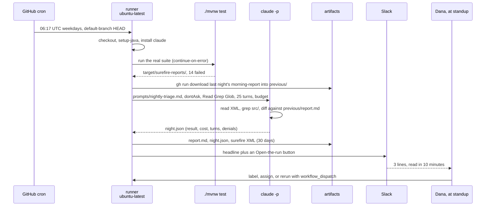

You are here if: you've run [The First Night](/overnight-qa/quick-start/) — or read it and want to know what every step of that workflow is *for* before you write a second job — or you're reviewing another team's nightly PR and need to know what a missing line costs at 02:17.

A nightly job looks like one YAML file. It's actually seven stages in a fixed order, and each stage fails in its own way, sits in a different seat, and spends a different slice of the 45 minutes. **Design the night stage by stage, and every failure on the incident page has an address.** This page walks the canonical read-only triage job — `nightly-triage.yml` from [The First Night](/overnight-qa/quick-start/#the-recipe) — through all seven, because every other job on this site (characterize, e2e, review, freshness) is the same skeleton with a different agent phase.

| Stage | What it's for | Seat | Minutes of 45 |
|---|---|---|---|
| Trigger | When, on which commit, and by whose hand | team | 0 — the clock starts when the runner does |
| Environment | Checkout, toolchain, database, test data, the CLI | team; platform for a self-hosted label | ~1 checkout, ~6 build |
| Deterministic phase | The real suite runs and writes XML | team | ~12 |
| Agent phase | A bounded `claude -p` reads the XML and answers one question | team — needs the CI credential | ≤15 |
| Evidence | Artifacts that outlive the runner | team | <1 |
| Report | The contract, delivered where people look | team — needs the webhook | ~1 |
| Human | Ten minutes at standup | team | 10, tomorrow morning |

Here is the triage night as a conversation between its parts:



## Trigger

The trigger decides three things: *when* the night runs, *which commit* it runs against, and *whether a person can start it by hand*. In `nightly-triage.yml` it's the `on:` block, quoted from the canonical workflow:

```yaml
on:
  schedule:
    - cron: "17 6 * * 1-5"   # 02:17 America/New_York (UTC-4) on weekdays. Odd minute on purpose:
                             # GitHub delays jobs queued at the top of the hour. Finishes well before
                             # the 03:00 settlement batch, which this job must never overlap.
  workflow_dispatch:         # rerun by hand: gh workflow run nightly-triage.yml -f budget_usd=5
    inputs:
      budget_usd:
        description: Cost ceiling for the agent step (USD)
        default: "3"
        type: string
```

**The clock is UTC unless you say otherwise.** GitHub's `schedule:` takes POSIX cron and evaluates it in UTC by default, so `17 6` is 06:17 UTC — 02:17 in New York while daylight time holds, 01:17 once it ends. As of September 2026 you can put an IANA `timezone:` next to the cron instead:

```yaml
on:
  schedule:
    - cron: "17 2 * * 1-5"
      timezone: "America/New_York"   # evaluated in local time, daylight-saving shifts included
```

The trade: `timezone:` keeps the distance to the 03:00 *local* batch constant all year; plain UTC is what every other cron in the org says and what the Actions tab shows. This site's canonical workflows stay in UTC because the winter shift moves the night *earlier* — further from the batch, never closer. Check which way the shift moves *you* before you pick.

**Odd minutes, because the top of the hour is a queue.** Jobs scheduled at `0 6` share their start with every other workflow in the world that liked a round number; under load GitHub delays them, and queued jobs can be dropped. Jobs at `17 6` mostly run when asked. The site's five jobs each take their own odd minute, ten minutes apart, so no two starts share a queue:

| Job | Cron (UTC) | New York | Runner |
|---|---|---|---|
| `nightly-e2e.yml` | `07 6 * * 1-5` | 02:07 | `[self-hosted, linux, payments]` |
| `nightly-triage.yml` | `17 6 * * 1-5` | 02:17 | `ubuntu-latest` |
| `nightly-characterize.yml` | `27 6 * * 1-5` | 02:27 | `ubuntu-latest` |
| `nightly-review.yml` | `37 6 * * 1-5` | 02:37 | `ubuntu-latest` |
| `nightly-freshness.yml` | `47 6 * * 1-5` | 02:47 | `ubuntu-latest` |

**The batch window is a wall.** `ledger-batch` runs 03:00–03:40 America/New_York against the shared staging database, and Marcus has nine years of reasons why nothing else may be in there with it. The rule binds the jobs that share the batch's world — e2e, which clicks through staging, and anything that talks to the Oracle test database. That's why e2e goes first and sets `timeout-minutes: 40` rather than 45: even at its full timeout it's off staging by 02:47. Triage and review read a checkout and talk to nobody, so one of them drifting past 03:00 costs minutes, not an incident.

**The night runs the default branch.** A scheduled workflow runs the default branch's copy of itself, against the default branch's latest commit. That's the point — the night's question is "what did yesterday's merges do?" — and it's also a trap: a workflow change on a feature branch doesn't run at night until it's merged. Prove it by hand first.

**Public repos have a 60-day rule.** Scheduled workflows on a public repository are disabled automatically after 60 days without repository activity, and forks have them off by default. Ledger's repos are private, but if you ever schedule a night on `ledger-docs` (last commit 2021) in a public org, it will quietly stop and nobody will be told.

**`workflow_dispatch` is the rerun button.** With `inputs:`, a rerun can carry a different ceiling than the schedule does. You run it when you've read an exit code 2 and agree the job deserved more:

```bash
# seat: team
gh workflow run nightly-triage.yml -f budget_usd=5
```

```console
✓ Created workflow_dispatch event for nightly-triage.yml at main
```

The `at main` at the end is the reminder from the paragraph above: a dispatch runs the default branch's copy of the file. The input reaches the job as `${{ inputs.budget_usd }}` and falls back to `'3'` on scheduled runs — `NIGHT_BUDGET_USD: ${{ inputs.budget_usd || '3' }}` in the workflow's `env:`. Raising the ceiling for a run you haven't read is the wrong answer; [the exit-code rule](/overnight-qa/running-unattended/#exit-codes-and-what-to-do-about-each) says why.

| Symptom | Cause | Fix |
|---|---|---|
| The night started at 03:20 and met the batch | Cron at the top of the hour, delayed under load; or the daylight-saving shift moved it the wrong way | An odd minute; recompute the UTC time for both halves of the year, or add `timezone:` |
| The night stopped running weeks ago and nobody noticed | Public repo with no commits for 60 days; or someone ran `gh workflow disable` and forgot | Commit activity or re-enable; put "did it run?" in the weekly ledger line |
| The workflow change didn't take effect | Schedules run the default branch's version of the file | Merge it, or start it with `workflow_dispatch` to test from the branch first |
| Two nights ran at once | No `concurrency` group, and a manual rerun overlapped the schedule | The `concurrency` block — see [Idempotency](#idempotency-the-night-that-runs-twice) below |

## Environment

The environment is everything the tests need to exist before they run — the checkout, the JDK, the database, the test data, the Claude Code binary — built fresh every night. Seat: team for anything that fits on `ubuntu-latest`; platform for a self-hosted runner label and the network route it implies.

**Checkout.** `actions/checkout@v7` gives you the default branch's latest commit at depth 1, which is all the triage job needs — it reads `src/` to locate causes, it doesn't read history. The characterization job asks "what changed in the last commit?", which is a `git diff` question that needs a parent to diff against, so that job sets `fetch-depth: 2`; [its workflow](/overnight-qa/characterization-tests/#the-workflow) shows the line.

**Toolchain.** `actions/setup-java@v6` with `cache: maven` — the six-minute build in the timing table assumes a warm cache; a cold one on the first night is what the ten minutes of slack are for. For `ledger-web` it's `actions/setup-dotnet@v6`. Then the CLI:

```yaml
      - name: Install Claude Code
        run: |
          curl -fsSL https://claude.ai/install.sh | bash -s stable
          echo "$HOME/.local/bin" >> "$GITHUB_PATH"   # the installer's bin dir is not on PATH in a non-login shell
```

That second line is the most common first-night failure on this site: the native installer puts `claude` in `~/.local/bin`, which a runner's non-login shell doesn't search, and the agent step dies with `claude: command not found`. `GITHUB_PATH` fixes it for every later step.

**A database, when the suite needs one.** `payments-api`'s suite runs self-contained, which is why it's the first subject. When a suite needs a real database, a `services:` container gives you one that exists for exactly as long as the job does. Postgres:

```yaml
    services:
      postgres:
        image: postgres
        env:
          POSTGRES_PASSWORD: nightly        # a throwaway container with synthetic data; not a credential
        ports:
          - 5432:5432
        options: >-                         # the health check is what stops the first test from
          --health-cmd pg_isready           # connecting to a database that is still booting
          --health-interval 10s
          --health-timeout 5s
          --health-retries 5
```

Oracle, for the Ledger repos whose tests touch PL/SQL, uses the `gvenzl/oracle-free` image; the pluggable database is `FREEPDB1`, so the JDBC URL is `jdbc:oracle:thin:@localhost:1521/FREEPDB1`:

```yaml
    services:
      oracle:
        image: gvenzl/oracle-free:latest
        env:
          ORACLE_RANDOM_PASSWORD: "true"    # SYS gets a random password nobody needs
          APP_USER: ledger                  # the schema the tests connect as
          APP_USER_PASSWORD: nightly        # throwaway; the container and its data live 40 minutes
        ports:
          - 1521:1521
        options: >-
          --health-cmd healthcheck.sh       # ships in the image; Oracle takes minutes to open
          --health-interval 20s
          --health-timeout 10s
          --health-retries 15
```

Service containers run on Linux runners only. And a fresh Oracle is an *empty* Oracle: Liquibase can rebuild everything `ledger-db` has changed since 2022, but the 1,200 objects older than that live in `legacy/DO_NOT_RUN`, and no container will ever have them.

**When you need the self-hosted runner instead.** Two reasons, both about the network: the test needs the real Oracle test database at `ledger-test-db.internal:1521/FREEPDB1` (the legacy schema, the real PL/SQL), or it needs the staging URL `https://ledger-staging.internal`. Then `runs-on: [self-hosted, linux, payments]` — `self-hosted` first, then the labels — and the label is a platform ask: name the database or URL and the job that needs it.

| | `services:` container on `ubuntu-latest` | `[self-hosted, linux, payments]` |
|---|---|---|
| What you gain | Reproducible, empty every night, no one else's data, no ask | The real schema, the real staging, the only way to test what the batch touches |
| What you pay | No legacy objects; Oracle's start-up minutes; Linux only | Shared and stateful: the night must clean up after itself, respect the batch window, and wait for the label |

**Test data.** The triage job needs none beyond what the suite seeds. The e2e job needs a dedicated staging user and a browser storage state generated by a deterministic script — never a real person's session; [Test data and auth](/overnight-qa/exploratory-and-e2e/#test-data-and-auth) is the recipe.

**The rule: the night rebuilds its world from scratch.** Nothing survives from one night to the next except the artifacts. On `ubuntu-latest` that's automatic — the runner is new. On a self-hosted runner the working directory can carry yesterday's `target/`, `pw-out/`, or `previous/`, so the first step of a self-hosted job deletes what the last night left. If a night needs something from yesterday, it downloads it from the artifact (the Evidence stage), which is the only memory the night is allowed to have.

| Symptom | Cause | Fix |
|---|---|---|
| Tests pass on laptops, fail at night | The container database lacks the legacy schema, or the suite assumes local test data | Self-hosted runner for that suite, or a seed script under `src/test/resources/` the job runs first |
| First test: connection refused | The database was still starting | The `--health-cmd` options above; raise `--health-retries` for Oracle |
| `claude: command not found` | `~/.local/bin` isn't on PATH in a non-login shell | `echo "$HOME/.local/bin" >> "$GITHUB_PATH"` after the install |
| Build took 20 minutes, not 6 | Cache miss | `cache: maven` on `setup-java`; read the cache line in the step log |
| Night 3 fails on leftovers night 2 didn't have | Self-hosted runner kept state | Delete `target/ pw-out/ previous/` as the first step |

## Deterministic phase

The real suite runs first, unchanged, and writes its results to disk. Then, and only then, the agent runs. The one line that makes this work:

```yaml
      - name: Deterministic phase — run the real suite
        id: tests
        continue-on-error: true            # red tests are the input, not a reason to stop
        run: ./mvnw -B -q test
```

Without `continue-on-error: true`, a red suite fails the job at this step and the agent never runs — which on a suite with fourteen tests red since March means the night never runs. The failures are the *input*.

**The agent interprets; it never replaces.** Whether a test passed is decided by `target/surefire-reports/*.xml`, not by the model. The model reads the XML, groups the failures by cause, finds the first stack frame inside `src/`, and says what's new. There are two reasons to hold this line and both are structural. Cost: a model that *runs* tests spends turns and budget deciding which ones, and decides differently every night. Evidence: a surefire XML is something a human can open; "the tests appear to pass" is a sentence. **A night's evidence is produced by deterministic tools; the agent's job is to explain it.**

Seat: team. Time: about twelve minutes for `payments-api`; whatever the suite already takes in CI today, because it's the same suite.

| Symptom | Cause | Fix |
|---|---|---|
| The agent step never ran | The tests step failed without `continue-on-error: true` | Add it; the last step of the workflow re-raises failure after the report is out |
| Report says GREEN on a night the suite didn't run | `-q` hid a compile error and there was no XML to read | The publish step's fallback verdict is RED when there's no result; make the prompt count from the XML, never from the absence of it |
| The agent "fixed" the failing tests | A triage job had write access | `--permission-mode dontAsk` with a read-only allowlist; the Field Note [The Night the Agent Fixed the Test by Deleting It](/blog/the-night-the-agent-fixed-the-test-by-deleting-it/) |

## Agent phase

The agent phase is one bounded `claude -p` call that answers one question. Bounded means four settings, each a flag or a workflow key, none of them a sentence in the prompt: *mode* (`--permission-mode dontAsk` plus an explicit `--allowedTools "Read,Grep,Glob"`, so anything else is denied and logged), *turns* (`--max-turns 25`, because a triage that hasn't converged in 25 turns is looping and a cheap loop slips under any budget), *budget* (`--max-budget-usd 3`, exit code 2 when hit), and *time* (`timeout-minutes: 45` on the job, the backstop that caps everything). The flags belong to [Running Claude Unattended](/overnight-qa/running-unattended/#bound-one-what-it-may-do); this page owns *where the step sits and what it sees*.

The canonical step, from `nightly-triage.yml`:

```yaml
      - name: Agent phase — read-only triage
        id: agent
        continue-on-error: true            # the report step must still run; the last step re-raises the failure
        run: |
          CODE=0
          scripts/run-claude.sh prompts/nightly-triage.md night.json \
            --bare \
            --permission-mode dontAsk \
            --allowedTools "Read,Grep,Glob" \
            --model sonnet || CODE=$?      # GitHub runs steps with bash -e; capture instead of aborting
          echo "exit=$CODE" >> "$GITHUB_OUTPUT"
          exit $CODE
```

`scripts/run-claude.sh` is the site's wrapper: it checks that one of the three credential paths is configured (`ANTHROPIC_API_KEY`, or `CLAUDE_CODE_USE_BEDROCK`, or `CLAUDE_CODE_USE_VERTEX`) without ever echoing it, adds `--output-format json`, the budget, and the turn cap, writes the JSON even when the run fails, and exits with claude's own exit code. It's shown in full in [Take this with you](/overnight-qa/running-unattended/#take-this-with-you-scriptsrun-claudesh).

**One question per job.** The triage job answers "which of tonight's failures are new, and what caused them?" — nothing else. The moment a prompt also asks for a security opinion or a coverage suggestion, the report gets longer, the turns climb, and the headline stops meaning anything. If you have a second question, you have a second workflow with its own cron, budget, and report.

**The prompt-file convention.** Every prompt lives in the repo at `prompts/<job>.md`, is reviewed like code, and its first line is a comment naming the file, whether the job is read-only, and whether `CLAUDE.md` is loaded. The wrapper passes it with `claude -p "$(cat "$PROMPT_FILE")"`. The full triage prompt is in [The First Night](/overnight-qa/quick-start/#the-recipe); its first line is the convention:

```text
# prompts/nightly-triage.md — READ-ONLY. Passed as the prompt by nightly-triage.yml. CLAUDE.md is NOT loaded (--bare).
```

:::note[What the model sees — the triage job]
At turn zero: Claude Code's built-in system prompt (yours only if you pass `--append-system-prompt` or `--system-prompt-file`), and `prompts/nightly-triage.md` in full as the user message. Nothing else is pushed in.

On demand, through `Read`, `Grep`, and `Glob` only: `target/surefire-reports/*.xml` and `*.txt` from tonight's suite; `previous/report.md` if the fetch step found one — and, because `gh run download` fetches the whole `morning-report` artifact, `previous/night.json` and last night's surefire XML are also on disk if the model goes looking, at a token cost if it does; any file under `src/` it chooses to open.

Not in context: `CLAUDE.md`, `.claude/rules/`, hooks, and skills — `--bare` skips auto-discovery, which is what you want for a triage that must judge the code and not the team's standing orders; the shell — `Bash` isn't on the allowlist, so a shell call is denied and appears in `permission_denials`; the network; the test database. The characterization job drops `--bare` on purpose because it *wants* the standing orders when it writes tests.
:::

Seat: team — needs the CI credential from the platform team (an API key in GitHub secrets with a spend cap, or OIDC to Bedrock with `CLAUDE_CODE_USE_BEDROCK=1` and `AWS_REGION`). Time: fifteen minutes is the *budget line*, not a flag; the turn cap and the cost ceiling enforce it indirectly, and `duration_ms` in the JSON is how you check.

| Symptom | Cause | Fix |
|---|---|---|
| Exit 2, partial report | Budget hit; or auth failed before the first turn | Read `result` and `total_cost_usd` first; rerun with `-f budget_usd=5` only if the work deserved it; an auth failure is a credential ask, not a rerun |
| `num_turns` is 25 every night | The prompt asks two questions, or the model is looping on a file it can't parse | Split the job; narrow the inputs listed in the prompt |
| `permission_denials` is non-empty | The model reached for `Bash` or `Edit` | Expected on a read-only job — the fence working; if it *needed* the tool, add it deliberately and re-review the blast radius |
| The report quotes team conventions the suite doesn't check | `CLAUDE.md` was loaded | Add `--bare` to triage-class jobs |

## Evidence

Evidence is what outlives the runner. When the job ends, the runner is gone; the only things that exist at 09:15 are the artifacts, the job summary, and whatever the report step sent elsewhere. **A night that can't prove it ran is a night that didn't.**

The triage job leaves four things: `target/surefire-reports/` (the XML and `.txt` the suite wrote — the primary evidence), `report.md` (the model's answer, extracted from the JSON), `night.json` (the `-p` output: cost, turns, denials, duration — the audit trail), and the job summary (the report rendered where a reviewer lands). The e2e job adds screenshots under `pw-out/`. They're uploaded once, together:

```yaml
      - uses: actions/upload-artifact@v7
        if: ${{ !cancelled() }}
        with:
          name: morning-report
          path: |
            report.md
            night.json
            target/surefire-reports/
          retention-days: 30
```

`retention-days` accepts 1–90 and defaults to 90. The site uses 30 because that's the audit window [Blast Radius](/overnight-qa/blast-radius/) asks for and a month of `total_cost_usd` for the ledger; longer costs storage for evidence nobody will reopen.

**Last night's report is tonight's memory.** "What's new since yesterday" is the whole reason a human reads the report, and the night can only answer it if it has yesterday. The previous report lives in a *different run's* artifact, so the job asks `gh` for the last successful run and downloads its artifact into `previous/`:

```yaml
      - name: Fetch last night's report (for "what's new")
        continue-on-error: true            # the first night has nothing to fetch
        env:
          GH_TOKEN: ${{ github.token }}
        run: |
          RUN_ID=$(gh run list --workflow nightly-triage.yml --status success --limit 1 --json databaseId -q '.[0].databaseId')
          [ -n "$RUN_ID" ] && gh run download "$RUN_ID" -n morning-report -D previous/ || echo "no previous run"
```

Three details carry weight. `permissions: actions: read` on the workflow is what lets `gh` read other runs — and because naming any key in `permissions:` sets every other key to `none`, it has to be named. `--status success` means a night whose agent failed never becomes the baseline: the comparison is always against the last night that finished properly. And `continue-on-error: true` on this step is what lets the first night run at all, with "no previous report" in the output.

| Symptom | Cause | Fix |
|---|---|---|
| Everything is NEW every night | `previous/` was empty: `actions: read` missing, or no run has ever reached `success` | Add the permission; check `gh run list --workflow nightly-triage.yml --status success --limit 1` returns anything |
| The artifact is hundreds of megabytes | Chatty `.txt` output, or screenshots of every step | Upload the XML and the report; keep screenshots to the steps that failed; `retention-days` lower |
| The report's evidence links are dead | They pointed at a runner path, or the artifact expired | Link the run and the artifact name; keep retention ≥ the review window |

## Report

The report is the contract between the night and the morning, and it's the subject of its own page — [The Morning Report](/overnight-qa/the-morning-report/). In three lines: **a headline verdict with the one number that matters; what's new since yesterday at the top, then every failure with `path:line` or a link and every "needs a human" with a proposed owner; what ran and what it cost.** The triage prompt emits exactly that shape, and the template in the report page is the same shape for every job.

Where it lands, in order of certainty: the job summary (always — `cat report.md >> "$GITHUB_STEP_SUMMARY"`, a megabyte per step is the limit), the Slack channel `#payments-nightly` (three lines and an "Open the run" button, via `slackapi/slack-github-action@v4` and an incoming webhook you create), GitHub (an issue per night, findings as children), and Confluence (the durable page under "Nightly QA" in `PAY`). Two mechanics in the canonical workflow deserve a sentence here because they're where report steps fail. Every report step carries `if: ${{ !cancelled() }}` rather than `if: always()`, so a cancelled run doesn't hang on the report while a failed agent still gets one. And the headline is *model output*, so the workflow reads it from the file with `jq --arg` and never passes it through `${{ }}` — an expression that interpolates model text into a shell step is a script-injection vector on a runner.

Seat: team — the webhook is yours to create as channel admin; a Confluence token is yours, under InfoSec's policy for which spaces.

| Symptom | Cause | Fix |
|---|---|---|
| Slack shows the wrong line as the headline | The model didn't follow the template, so line 2 isn't the verdict | The prompt's "output ONLY the following markdown"; for a hard guarantee, `--json-schema` and read `structured_output` |
| No Slack post on the night the agent failed | The post step had no `if:` and ran only on success | `if: ${{ !cancelled() }}` on every report step |
| The summary is cut off | Over the 1 MiB per-step limit | Summary gets the report; the long output goes in the artifact |

## Human

The night ends at a person, or it didn't happen. The ritual is ten minutes at standup, in a fixed order: headline → what's new → needs-a-human → assign each item → close the night's issue. That order matters because the first two lines decide whether the other eight minutes are needed; a GREEN night with "nothing new" is a thirty-second night, and that's a success, not a waste.

Labels do the bookkeeping: `nightly` on everything the night files, `needs-human` on what it can't resolve, `nightly:flaky` on a failure that has flipped state twice — so the same test doesn't earn a fresh finding every morning. The proposed owner comes from `CODEOWNERS` when the failing file matches a rule (the prompt asks for exactly that), and the label moves off `needs-human` when a person has taken it. Dana owns the ritual; the owner named on each item owns the follow-up; the report-actioned rate — items someone did something with, over items reported — is the number that decides whether the job survives, and [Cost and Governance](/overnight-qa/cost-and-governance/) has the 20% rule.

| Symptom | Cause | Fix |
|---|---|---|
| Nobody opened it this week | Same content every day, no "new" section, no owner | The report contract; the Field Note [The Morning Report Nobody Read](/blog/the-morning-report-nobody-read/) |
| Forty open `nightly` issues | An issue per flaky test, no de-duplication | One issue per night, children only for NEW groups, `nightly:flaky`, a fingerprint in the body |
| The proposed owner is always Dana | `CODEOWNERS` has one rule | Fix `CODEOWNERS`; it's the cheapest KT artifact in the estate |

## The timing budget

The job has 45 minutes — `timeout-minutes: 45` — and the plan uses 35 of them:

| Stage | Budget | What it assumes |
|---|---|---|
| Checkout, install the CLI | 1 min | Depth-1 checkout; the native installer |
| Build | 6 min | A warm Maven cache |
| Tests | 12 min | The same suite CI runs today |
| Agent | ≤15 min | 25 turns, a $3 ceiling, `sonnet` |
| Report, upload, Slack | 1 min | Small artifacts |
| **Total** | **35 of 45** | Ten minutes for a cold cache and a slow runner |

Without the `timeout-minutes` line the default is 360 — six hours — which is how a stuck job runs until breakfast. But the timeout is a wall, not a plan: **if the night regularly passes 35 minutes, move the cron earlier or shrink a stage; never move the timeout later.** For jobs that share the batch's world, later means the batch.

The agent's fifteen minutes are checked, not enforced. Read them from the JSON every night:

```bash
# seat: team
jq '{duration_ms, num_turns, total_cost_usd}' night.json
```

```console
{
  "duration_ms": 212873,
  "num_turns": 14,
  "total_cost_usd": 0.41
}
```

`duration_ms` is the line: 212,873 ms is three and a half minutes, well inside the budget. If it climbs toward fifteen with `num_turns` at the cap, the prompt is asking for too much; tighten the question before you tighten the flag. The other stages' durations are on the run's step list in the Actions tab.

## Idempotency: the night that runs twice

A night runs twice when a manual rerun overlaps the schedule, or when someone starts it from the Actions tab to check a fix. Two agents in the same staging window, or two writers on the same branch, is the failure you're preventing. The `concurrency` block does it:

```yaml
concurrency:
  group: nightly-triage      # a manual rerun never overlaps the scheduled run
  cancel-in-progress: false
```

`cancel-in-progress: false` makes the second run *wait* rather than kill the first — killing a run thirty minutes in throws away its evidence, and the wait is short. Note what a rerun then does: it posts to Slack again (acceptable — the button says which run), it uploads a second artifact, and its "new since last night" compares against the run that just finished, so it reports "nothing new". That's correct, and it's why the rerun's job is to check a fix, not to re-report. Writing jobs need one more property: the characterization branch is `nightly/characterize-<YYYY-MM-DD>`, created by the workflow and not the agent, so a same-day rerun lands on a branch name that already exists — read [that page's workflow](/overnight-qa/characterization-tests/#the-workflow) before rerunning a writing job by hand, and prefer to let the next night take it. A rerun by hand is always `gh workflow run <file> -f <input>=<value>`; the inputs are how a rerun differs from the schedule without editing the file.

:::tip[Good citizen]
Staging is shared, and so is the night. The `catalog` team's nightly starts at 01:30 on the same staging environment, and the settlement batch owns 03:00–03:40. The e2e job's cron is `07 6` — 02:07 New York — because that's the gap: after their window, before the batch, with its `timeout-minutes: 40` ending at 02:47 whatever the agent is doing. Before you schedule any job that touches a shared environment, find out whose window you're in, write it in the workflow comment next to the cron, and never test payments there. If the environment's calendar is a Confluence page, that page is the first thing your PR links.
:::

## Where next

- **Next in the journey:** [Running Claude Unattended](/overnight-qa/running-unattended/) — the agent phase in full: the three bounds and their flags, the JSON field by field, exit codes, `--bare`, `--json-schema`, and the wrapper script.
- **The lateral jump:** [The Night Failed](/troubleshooting/the-night-failed/) — the incident page, organised by the same seven stages, for when it's 08:05 and one of them didn't happen.
