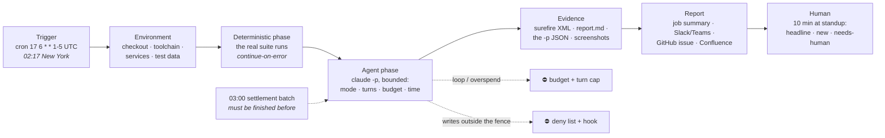

This section teaches you to run AI-driven QA while nobody is watching — on *this* kind of setup: scheduled GitHub Actions workflows, a credential the platform team issued, a modern service with a decent test suite (`payments-api`) sitting next to a legacy estate with almost none (`ledger-*`), a staging environment other teams also use, an Oracle test database on the internal network, and a settlement batch that runs at 03:00 and must not be disturbed. The output is a **morning report**: what ran, what failed, what's new, what needs a human, what it cost — in Slack or Teams for the summary, GitHub for the follow-ups, Confluence for the record. If that describes your Tuesday, you're in the right place.

**Find your way in.** Nobody reads a playbook cover to cover:

| You are… | Start at |
|---|---|
| Facing a specific problem ("the suite is red and nobody knows which failures matter") | [Start From Your Situation](/overnight-qa/scenarios/) |
| Told to "get AI testing going" this sprint | [The First Night](/overnight-qa/quick-start/) |
| Wondering what an agent may and may not do at 2 a.m. | [Blast Radius](/overnight-qa/blast-radius/) |
| Trying to read a `claude -p` JSON result or an exit code | [Running Claude Unattended](/overnight-qa/running-unattended/) |
| The security reviewer, deciding whether to approve this | [Blast Radius](/overnight-qa/blast-radius/) — written as your evidence pack |
| Reviewing another team's first nightly-job PR | [The review checklist](/overnight-qa/cost-and-governance/#the-nightly-job-pr-review-checklist) |
| The night failed and it's 8:05 | [The Night Failed](/troubleshooting/the-night-failed/) — the incident page |
| Just here for the tables, workflows, and the report template | [Overnight QA on One Page](/overnight-qa/cheat-sheet/) |

Everyone else: read on. This page explains overnight QA from zero and maps the rest.

## What overnight QA actually is

Strip away the vendor language and it's this: **a scheduled job runs a bounded agent against yesterday's code while nobody is watching, and leaves evidence — not opinions — for a human to act on in the morning.**

Three words in that sentence carry the whole method:

- **Bounded.** The agent has a permission mode (what it may do), a turn cap (how long it may think), a cost ceiling (how much it may spend), a time limit (when the runner kills it), and a list of places it may write. Every one of these is a flag or a setting, never a sentence in the prompt asking it to behave. [Running Claude Unattended](/overnight-qa/running-unattended/) is the page for the flags; [Blast Radius](/overnight-qa/blast-radius/) is the page for the list.
- **Evidence.** A finding is a failing test with its stack trace, a diff, a screenshot, a SARIF row, a `path:line` — something a human can click and check in twenty seconds. A paragraph that says "the settlement module appears fragile" is not a finding; it's a prompt for a human to go and do the work the agent was supposed to do. [The Morning Report](/overnight-qa/the-morning-report/) is the contract.
- **Act on.** The report exists to change what someone does at 9:15. If the report-actioned rate — findings a human did something with, divided by findings reported — is low, the job is noise and the fix is to redesign it, not to make the prose more urgent.

The agent is usually Claude Code in headless mode (`claude -p`), run as a step in a workflow after the deterministic tests have already run. It never *replaces* the test suite; it *reads* the suite's output, the diff, the logs, the scan results, and does the part that used to need a person with context: grouping, explaining, deciding what's new, and saying who should look. Sometimes it also *writes* — characterization tests, a draft PR — and every page where it writes says exactly where and how that's fenced.

## Why it's harder here than in the demo

Every "AI tests your code overnight" demo carries four silent assumptions: someone is watching, the environment is clean, the money is free, and the report will be read. None of them hold for you.

**Nobody is watching.** In an interactive session, you are the safety mechanism: you see the agent about to run `rm -rf` on the wrong directory and you say no. At 02:17 there is nobody to say no. Every safety property has to be *structural* — `--permission-mode plan` for a read-only job, a deny list and a hook for a writing job, `permissions: contents: read` on the workflow, an environment protection rule in front of anything that matters — because "please don't delete tests" in a prompt is a request, and the Field Note [The Night the Agent Fixed the Test by Deleting It](/blog/the-night-the-agent-fixed-the-test-by-deleting-it/) is what a request is worth.

**The environment is someone else's at 2 a.m.** The staging environment is shared with the `catalog` team, whose own nightly run starts at 01:30. The Oracle test database is on the internal network, so the job needs a self-hosted runner, and that runner has yesterday's checkout on it unless the job cleans up. The settlement batch fires at 03:00 local and a browser agent still clicking through settlement screens at 03:05 is an incident. The night rebuilds its world from scratch, fences its origins, and finishes before the batch — [Anatomy of a Night Shift](/overnight-qa/anatomy-of-a-night/) has the timing table.

**The money has no one watching the meter.** An interactive session that loops costs you your own attention; a nightly job that loops costs the team's monthly budget by 06:00. So a budget flag alone isn't enough — a cheap loop can run a thousand turns under a small budget — and every job carries both `--max-budget-usd` and `--max-turns`, plus the runner's `timeout-minutes` as the backstop. The cost arithmetic and the ledger are in [Cost and Governance](/overnight-qa/cost-and-governance/).

**The report will be ignored unless it earns ten minutes.** The most common failure mode of overnight QA isn't a dangerous agent; it's a harmless one whose report says the same eleven things every day. [The Morning Report Nobody Read](/blog/the-morning-report-nobody-read/) is that story. The fix is the report contract: a headline verdict, *what's new since yesterday* near the top, every finding with evidence and a proposed owner, and a standup ritual that closes the night's issue.

Here's the whole night, with the two walls drawn in:

Each box is a page: the trigger, environment, and evidence stages are [Anatomy of a Night Shift](/overnight-qa/anatomy-of-a-night/); the agent phase is [Running Claude Unattended](/overnight-qa/running-unattended/); the walls are [Blast Radius](/overnight-qa/blast-radius/); the report and the human are [The Morning Report](/overnight-qa/the-morning-report/).

## The maturity ladder

You do not need all of this at once. Each level is a fine place to stop and live for a quarter:

| Level | What it looks like | You are here if… | The pages |
|---|---|---|---|
| **0 — A nightly suite nobody reads** | `./mvnw test` runs on a cron; the email goes to a folder; 14 tests have been red since March | Every team starts here; nothing is wrong yet, except the folder | — |
| **1 — Read-only triage** | The suite runs; a read-only agent groups the failures by cause, cites the stack traces, says what's new vs last night, posts a 3-line summary to the channel; costs pocket change | You need one safe, useful night this week | [The First Night](/overnight-qa/quick-start/) |
| **2 — The night writes tests** | For code changed yesterday (or the class Sam touches next), the agent generates characterization tests, runs them three times, keeps only the deterministic ones, opens **one draft PR**; mutation testing gates quality | Your legacy modules have no safety net and the migration is coming | [Characterization Tests](/overnight-qa/characterization-tests/) |
| **3 — The night looks around** | A browser agent clicks through staging scenarios with screenshots as evidence; the day's PRs get a deep review comment; scans run and the agent writes the *impact* paragraph per finding | Reviewers are swamped, the UI has no tests, security wants impact not CVE lists | [Exploratory & E2E](/overnight-qa/exploratory-and-e2e/), [Review & Security](/overnight-qa/review-and-security/) |
| **4 — Governed night shift** | Report-actioned rate tracked; cost ledger read weekly; the review checklist gates new jobs; a reusable workflow five teams share; self-healing proposals as draft PRs a human merges | You're the person rolling this out beyond your team | [The Morning Report](/overnight-qa/the-morning-report/), [Cost & Governance](/overnight-qa/cost-and-governance/) |

The next step is always one level up, never a leap to the top. L1 is *not* a toy: on this site's cast it turned fourteen permanently-red tests into three root causes and one owner in its first week.

## The three questions before any nightly job

Every page in this section is ultimately serving one of these. Ask them in order, for every job you're about to schedule:

1. **What question should the night answer?** Not "test everything" — something a human would recognise as a question: "did yesterday's changes break settlement?", "does `MoneyMath` still round the way it did before the Java 17 cutover?", "can the operator still close a batch in the UI?". One question per job. If you can't state it, you can't write the report's headline line, and the job will drift toward doing everything badly. → [Anatomy of a Night Shift](/overnight-qa/anatomy-of-a-night/)
2. **What evidence would prove the answer?** A failing test, a diff, a screenshot, a SARIF row, a `path:line`. Name it before writing the prompt — the prompt's job is to produce *that*, not prose about it. → [The Morning Report](/overnight-qa/the-morning-report/)
3. **What's the blast radius if the agent is wrong?** Reading a log: none. Writing a test: a draft PR someone reviews. Clicking through shared staging: someone else's test data. Anything that touches production or `main`: not on this site. The blast radius decides the permission mode, the fence, and who has to approve. → [Blast Radius](/overnight-qa/blast-radius/)

## The citizenship contract

One idea underpins the whole section, so it's stated once, here:

**An unattended agent is a new hire with root and no manager. Bound it before you trust it.** You would not give a new hire a production credential, an unlimited corporate card, and an empty office on their first night. The agent is more capable than the new hire and has worse judgment about consequences, and at 02:17 there is no manager. So the contract is:

- **Read-only by default.** A job gets write access only when its page says exactly which paths, on which branch, fenced by which hook. Everything else runs in `plan` mode.
- **Writes go to a branch and a draft PR — never `main`, never production, never someone else's repo.** The workflow's `permissions:` block enforces the first two; the fence enforces the rest.
- **Every run has a cost ceiling *and* a turn cap *and* a time limit.** Three bounds, because each one fails to catch something the others catch.
- **Every finding links to evidence, or it's labelled as inference.** The report contract makes this mechanical.
- **Every job has a kill switch someone can throw without reading the code** — `gh workflow disable`, tested once before the first real night.
- **Someone reads the ledger.** The `total_cost_usd` from every night's JSON goes into an artifact; a weekly line in the report sums it.

The recurring `:::tip[Good citizen]` aside appears wherever a job could spend someone else's money, attention, or test window: an unbounded turn cap, a report that repeats yesterday, an issue per flaky test, a browser agent in shared staging during another team's run.

## Who owns what

The recurring boundary table, at section level. Details vary per page, but the shape never does:

| Concern | PLATFORM / SECURITY | YOU (the delivery team) |
|---|---|---|
| The credential in GitHub secrets (API key, or OIDC to Bedrock/Vertex) and its spend cap | ✔ issues it | ask, with the job list and the per-run budget; never mint your own |
| Org-level Actions policy, runner pool, self-hosted runner labels | ✔ | name the label you need and why (the Oracle DB, the staging URL) |
| Approval that this job may run unattended with these permissions | ✔ security | bring [the evidence pack](/overnight-qa/blast-radius/#the-security-review-evidence-pack) |
| Environment protection rules on `staging` | ✔ (usually) | ask for the night's identity to be allowed, on a schedule |
| The workflows, prompts, hooks, deny lists in your repo | | ✔ yours, reviewed like code, with [the checklist](/overnight-qa/cost-and-governance/#the-nightly-job-pr-review-checklist) |
| The report template, the channel, the Confluence parent page | | ✔ yours |
| Reading the report at standup and closing the night's issue | | ✔ yours — the whole point |
| The cost ledger and the report-actioned rate | | ✔ yours, honestly |
| Turning a job off when its actioned rate falls below 20% for two weeks | | ✔ yours, without a meeting |

If a checklist item in this section fails on the left column, that's a named ask — [Working Within Policy](/start/working-within-policy/) has the requests written out with the evidence to attach.

:::note[Where's the Kubernetes CronJob?]
Some shops would rather run the night on the cluster they already operate than on GitHub-hosted runners — closer to the test database, no runner pool to negotiate. This site builds on scheduled GitHub Actions because that's where the repos, secrets, PRs, and issues already are, and because a `schedule:` trigger is one line. If your platform team points you at the cluster instead, the anatomy and the bounds don't change; the sister site's [Jobs and CronJobs](https://jamiegunn.github.io/k8s_soup_to_nuts/workloads/jobs-and-cronjobs/) page owns the mechanics.
:::

## Start here by situation

If you already know what brought you here (if not: [Start From Your Situation](/overnight-qa/scenarios/) has twelve):

| Your situation | The page |
|---|---|
| The suite is red and nobody knows which failures matter | [The First Night](/overnight-qa/quick-start/) |
| A legacy module with no tests is about to be changed | [Characterization Tests](/overnight-qa/characterization-tests/) |
| The UI has no automated tests at all | [Exploratory & E2E](/overnight-qa/exploratory-and-e2e/) |
| Security wants a nightly dependency check with impact, not a CVE list | [Review & Security](/overnight-qa/review-and-security/) |
| The morning report is ignored | [The Morning Report](/overnight-qa/the-morning-report/) |
| The night burned the budget | [Cost and Governance](/overnight-qa/cost-and-governance/), then [The Night Failed](/troubleshooting/the-night-failed/) |

## Where next

- **Next in the journey:** [The First Night](/overnight-qa/quick-start/) — read-only, budgeted, reporting to the channel, running tonight.
- **The lateral jump:** if a specific pain brought you here, [Start From Your Situation](/overnight-qa/scenarios/) routes you straight to it.
