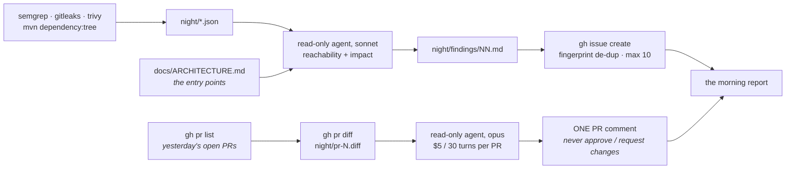

You are here if: the day's PRs sit unreviewed because the two people who could review them are the two people everyone is already waiting on; or security asked for "a nightly dependency check" and what they actually want is *impact*, not another list of CVEs.

These three jobs share one shape, which is why they share a page. Something deterministic has already produced the raw material — a diff, a scanner's JSON, a dependency tree — and the material is complete, correct, and useless at 9:15 because nobody has time to read it against *this* codebase. The night's job is the reading. It answers one question per artifact (*does this change break a caller? is this finding reachable from an endpoint? which direct dependency drags this transitive one in?*) with a `path:line` for every answer, and it never holds the power to act on its own answer: no approval, no merge, no suppression, no fix. **The scanner's severity is the scanner's; the impact is the night's; the decision is a human's.**

The levers, for all three: **Context** is the diff or the JSON plus the repository the agent may grep; **Tools** are `Read`, `Grep`, `Glob` and nothing else; **Proof** is the `path:line` in every finding and the human who reads it at standup. Nothing on this page writes to the repository. What it writes is a PR comment and a handful of issues, through `gh`, in a workflow step the agent never touches.



## Job one: the night reviews yesterday's PRs

A nightly review reads every PR opened yesterday that is still open, with the whole repository available to grep, on the most capable model, with a turn budget a PR-time check can't afford — and leaves **one comment**. It does not approve, and it does not request changes, for two reasons that are worth stating because your reviewers will ask.

The first is standing. A review that blocks a merge has to be answerable: the author replies "why?", and someone must be there to say. At 02:37 nobody is. A comment is information; an approval or a block is a decision, and the night has no manager to escalate a decision to. The second is structural. Branch protection counts approvals, and an approval posted by the workflow's identity would satisfy a required-review rule — which turns the night into a rubber stamp for anything, including a PR that changes the night's own workflow. `gh pr comment` and `gh pr review --approve` need the same `pull-requests: write` permission, so this line is *not* drawn by `permissions:`; it's drawn by the script (the workflow calls `gh pr comment` and nothing else) and by the prompt. That is one of the honest rows in [Blast Radius](/overnight-qa/blast-radius/): enforced by code you review, not by a permission.

Here is the workflow. Cron `37 6 * * 1-5` is 02:37 New York, twenty minutes after triage so the two never queue at the same minute; per-PR budget and turns are the A18 defaults ($5, 30 turns).

```yaml
# .github/workflows/nightly-review.yml — job one of two (the `impact` job is appended below)
name: Nightly review (read-only, comments only)

on:
  schedule:
    - cron: "37 6 * * 1-5"   # 02:37 America/New_York on weekdays; odd minute; 20 min after triage.
                             # GitHub-hosted, read-only, touches no environment — so the 03:00 batch
                             # window does not apply to this job (it does to e2e; see Blast Radius).
  workflow_dispatch:
    inputs:
      since:
        description: Review PRs created on or after this date (YYYY-MM-DD); blank = yesterday
        default: ""
        type: string

concurrency:
  group: nightly-review      # a manual rerun never overlaps the scheduled run
  cancel-in-progress: false

jobs:
  review:
    runs-on: ubuntu-latest
    timeout-minutes: 45      # MAX_PRS agent runs at ~4 min each; budget and turns cap each, this caps the sum
    permissions:
      contents: read         # checkout only
      pull-requests: write   # gh pr comment — the ONLY write this job performs (no approve, no merge)
    env:
      # seat: team — needs the CI credential from the platform team (API-key path shown;
      # for Bedrock set CLAUDE_CODE_USE_BEDROCK=1 + AWS_REGION and use OIDC instead).
      ANTHROPIC_API_KEY: ${{ secrets.ANTHROPIC_API_KEY }}
      GH_TOKEN: ${{ github.token }}
      SINCE: ${{ inputs.since }}     # read via env, never interpolated into the script (injection)
      NIGHT_BUDGET_USD: "5"          # per PR — the A18 default for the review job
      NIGHT_MAX_TURNS: "30"          # a review that hasn't converged in 30 turns is reading the whole repo
      MAX_PRS: "8"                   # the night's ceiling is MAX_PRS × NIGHT_BUDGET_USD = $40; the rest are listed
    steps:
      - uses: actions/checkout@v7    # the agent greps the tree for call sites; the diff itself comes from the API

      - name: Install Claude Code
        run: |
          curl -fsSL https://claude.ai/install.sh | bash -s stable
          echo "$HOME/.local/bin" >> "$GITHUB_PATH"   # the installer's bin dir is not on PATH in a non-login shell

      - name: List yesterday's open PRs
        run: |
          [ -n "$SINCE" ] || SINCE=$(date -u -d yesterday +%F)
          mkdir -p night
          gh pr list --search "created:>=$SINCE" --state open --json number,title,url > night/prs.json
          jq -r '.[] | "#\(.number) \(.title)"' night/prs.json

      - name: Agent phase — one read-only review per PR
        id: agent
        continue-on-error: true            # one bad PR must not stop the others; the last step re-raises
        run: |
          FAILED=0; n=0
          for N in $(jq -r '.[].number' night/prs.json); do
            n=$((n+1))
            if [ "$n" -gt "$MAX_PRS" ]; then echo "#$N" >> night/unreviewed.txt; continue; fi
            gh pr diff "$N" > "night/pr-$N.diff"
            # The prompt file is generic; the PR number and diff path are appended per run.
            { cat prompts/nightly-review.md; printf '\nPR #%s. The diff is in night/pr-%s.diff.\n' "$N" "$N"; } > "night/prompt-$N.md"
            scripts/run-claude.sh "night/prompt-$N.md" "night/review-$N.json" \
              --bare \
              --permission-mode dontAsk \
              --allowedTools "Read,Grep,Glob" \
              --model opus || FAILED=$((FAILED+1))
            jq -r '.result // empty' "night/review-$N.json" > "night/review-$N.md"
            if [ -s "night/review-$N.md" ]; then
              gh pr comment "$N" --body-file "night/review-$N.md"    # the only write, and it is a comment
            else
              echo "#$N (no result)" >> night/unreviewed.txt
            fi
          done
          echo "failed=$FAILED" >> "$GITHUB_OUTPUT"

      - name: Publish — job summary and artifact
        if: ${{ !cancelled() }}
        run: |
          {
            echo "## Night review — payments-api — $(date -u +%F)"
            echo "reviewed: $(ls night/review-*.md 2>/dev/null | wc -l) · not reviewed: $(wc -l < night/unreviewed.txt 2>/dev/null || echo 0)"
            # The glob does not expand on a night with no open PRs, and jq would then fail the step
            # under bash -e — so guard it. "no PRs to review" is a valid night, not a broken one.
            ls night/review-*.json >/dev/null 2>&1 \
              && jq -s '{cost_usd: (map(.total_cost_usd // 0) | add), turns: (map(.num_turns // 0) | add)}' night/review-*.json \
              || echo '{"cost_usd": 0, "turns": 0}  # no PRs opened yesterday'
          } >> "$GITHUB_STEP_SUMMARY"

      - uses: actions/upload-artifact@v7
        if: ${{ !cancelled() }}
        with:
          name: morning-report-review
          path: night/
          retention-days: 30

      - name: Re-raise if any review failed
        if: ${{ steps.agent.outputs.failed != '0' }}
        run: |
          echo "${{ steps.agent.outputs.failed }} review run(s) failed (see run-claude lines above)"
          exit 1
```

Two things in that file deserve a sentence. `SINCE` is read from the environment, not written into the script with `${{ }}`, because anything a person can type into a dispatch input is a script-injection vector on a runner — the same rule A9 applies to the model's headline. And `--bare` keeps startup fast and the context clean, at a price: the review doesn't know the repo's conventions unless the prompt says them. Put the three rules that matter in the prompt; don't load the whole `CLAUDE.md` for a job that reads other people's diffs. The mechanics of `--bare` and the rest of the flags are on [Running Claude Unattended](/overnight-qa/running-unattended/#bound-one-what-it-may-do), and the wrapper is [`scripts/run-claude.sh`](/toolkit/headless-and-sdk/#the-example-run-claudesh).

The prompt is where the review's standards live, and it says what the output must look like so the comment is the same shape every night:

```text
# prompts/nightly-review.md — one read-only review of one PR. Output is ONE comment; you have no standing to approve or block.
You are reviewing a pull request in payments-api overnight. Nobody will answer questions, so do not ask any.

Inputs
- The PR number and the path to its diff are on the last line of this prompt.
- You may read any file in the repository to check what the diff touches (Read, Grep, Glob). You may not run anything or change anything.

What to look for, in this order
1. Behaviour changes the PR title does not mention (compare the diff to the title).
2. Callers the diff breaks: for every changed public method, grep for its call sites and name any the PR did not update.
3. Tests: which changed lines have no test touching them (cite the test file if one exists; say "no test found — inference" if not).
4. Anything that would embarrass us in production: unbounded queries, swallowed exceptions, money arithmetic done with raw BigDecimal instead of the shared rounding helper, logging of card or account numbers.

Rules
- Every finding cites the diff hunk (`path:line` in the new file) and, where you read beyond the diff, the call site (`path:line`).
- A claim you could not verify by reading is labelled "(inference)".
- At most 8 findings, most important first. No style comments. No praise.
- Do not write "approve", "request changes", or "LGTM". A human decides; you inform.

Output (markdown, exactly this shape)
## Night review — PR #<n>
**Read:** <files read beyond the diff, or "diff only">
### Findings
1. **<one line>** — `path:line` — <why it matters, one sentence> (verified | inference)
### Untested changes
- `path:line` — <what changed> — <test file, or "no test found — inference">
### Not checked
- <anything you ran out of turns for, or could not read; or "nothing">
<!-- nightly-review -->
```

:::note[What the model sees]
The prompt above, the two appended lines naming the PR and its diff file, and whatever it reads from the checkout. No `CLAUDE.md`, no hooks, no skills (`--bare`); no MCP servers; no PR description (the title is in `night/prs.json` if you want to pass it — the diff is the evidence, the description is a claim).
:::

What a run leaves in the log, per PR, is the wrapper's two lines. The second is the one to read:

```console
run-claude: exit=0
run-claude: cost_usd=2.31 turns=19 is_error=false denials=0 duration_ms=248117
```

`denials=0` says the read-only allowlist and the prompt agreed — nothing was refused mid-run. `turns=19` of 30 says it converged. And the comment it posted on PR #481 (representative — the numbers are the cast's, not yours):

```markdown
## Night review — PR #481
**Read:** src/main/java/com/payments/api/export/CsvExportService.java, src/main/java/com/payments/api/settlement/SettlementTotals.java, src/test/java/com/payments/api/export/CsvExportServiceTest.java
### Findings
1. **The totals row rounds each line before summing** — `src/main/java/com/payments/api/export/CsvExportService.java:112` — the sum of rounded lines can differ from the rounded sum by a cent, and `SettlementTotals.sum` (`src/main/java/com/payments/api/settlement/SettlementTotals.java:41`) does it the other way, so the CSV and the API will disagree on some batches (verified: both methods read).
2. **`exportBatch(String)` changed its return type; one caller was not updated** — `src/main/java/com/payments/api/export/ExportController.java:57` still assigns the old type (verified: grep for `exportBatch(`).
3. **Raw `BigDecimal.setScale(2, HALF_UP)` in money code** — `src/main/java/com/payments/api/export/CsvExportService.java:109` — the rest of the module routes rounding through one helper; this line does not (inference: no repo rule was loaded — this run is `--bare`).
### Untested changes
- `src/main/java/com/payments/api/export/CsvExportService.java:105-118` — the totals row — `CsvExportServiceTest.java` has no test naming totals (verified).
### Not checked
- nothing; 19 of 30 turns used.
<!-- nightly-review -->
```

Every line the author might argue with carries a path and a line, and the one the agent could not verify says so. That is the whole standard: **a review finding without a `path:line` is an opinion, and the night does not post opinions.**

A rerun of this workflow posts a second comment on the same PR. That's tolerable for a comment and intolerable for an issue — which is why the issue path at the bottom of this page carries a fingerprint and the comment path doesn't.

### The PR-time alternative, and why you run both

The other place a review can happen is when the PR is opened, with the Claude Code GitHub Action in automation mode (a `prompt:` input present) and the code-review plugin. This is the whole workflow; the Action's inputs are the [Toolkit's](/toolkit/github-action/), so one recipe here and no more:

```yaml
# .github/workflows/pr-review.yml — the light, PR-time review
name: PR review (light)

on:
  pull_request:
    types: [opened, synchronize, ready_for_review]

permissions:
  contents: read
  pull-requests: write     # the review comment; nothing else
  id-token: write          # only for the OIDC → Bedrock path (use_bedrock: true); remove on the API-key path

jobs:
  review:
    runs-on: ubuntu-latest
    timeout-minutes: 15    # a PR check that takes longer than this is the wrong kind of review
    steps:
      - uses: actions/checkout@v7
      - uses: anthropics/claude-code-action@v1
        with:
          anthropic_api_key: ${{ secrets.ANTHROPIC_API_KEY }}   # seat: team — the same CI credential
          plugins: "code-review@claude-code-plugins"            # the code-review plugin; check /plugin for the exact name your org's marketplace publishes
          prompt: |
            Review this pull request with the code-review plugin. Post ONE comment: findings only,
            each with path:line, most important first, at most 5. Do not approve, request changes,
            or write LGTM — a human decides.
          claude_args: "--model sonnet --max-turns 15 --max-budget-usd 2 --allowedTools \"Read,Grep,Glob\""
```

The two are not competitors; they answer different questions at different moments, and the trade is honest in both directions:

| | PR-time (`pr-review.yml`) | Nightly (`nightly-review.yml`) |
|---|---|---|
| **What you gain** | The comment lands while the author is still in context; the obvious is caught before a human reviewer spends a minute; it runs where reviewers already look | The whole day's diffs with the repository to grep, `opus`, 30 turns per PR; cross-file findings (the caller that wasn't updated); a cost you can cap per night, not per push |
| **What you pay** | Runs on every push (cost × pushes); it must be shallow to be fast; the temptation to make it a required check, which turns a comment into a gate nobody can answer for | The author has moved on; the comment lands on a PR that may already be merged, so a finding on merged code needs an issue instead; opus per PR is the night's most expensive line |
| **The question it answers** | "Anything that would embarrass us?" | "What did the day's reviewers miss?" |

**The site's rule: run both — PR-time light, nightly deep.** Light means `sonnet`, fifteen turns, five findings, two dollars. Deep means the diff plus the tree, `opus`, and a comment that reads like the review your best engineer would leave if she had forty uninterrupted minutes per PR, which she has not had since 2023.

## Job two: security — the scan is deterministic, the impact is the night's

There are two security jobs, and the plain-language difference matters: **at PR time, a review of the diff; at night, judgment on the scanners' output.** Neither replaces the scanners. A scanner is deterministic, cheap, and complete; an agent is none of those. What an agent adds is the thing a scanner cannot know — whether the vulnerable line is reachable from anything a user can touch in *this* system.

### At PR time: `/security-review`

Interactively, `/security-review` is a built-in skill that checks the current diff for security vulnerabilities; you can customize it by copying `.claude/commands/security-review.md` from the action's repository. In CI the same review runs as `anthropics/claude-code-security-review`. As of September 2026 it has no version tags, so you pin a commit SHA and bump it deliberately — `@main` is the alternative and it means "whatever shipped last night", which is not a phrase a security reviewer wants to hear.

```yaml
# .github/workflows/pr-security-review.yml
name: Security review (at PR time)

on:
  pull_request:

permissions:
  contents: read
  pull-requests: write     # it comments on the PR

jobs:
  security-review:
    runs-on: ubuntu-latest
    timeout-minutes: 30
    steps:
      - uses: actions/checkout@v7
      - id: sec
        # No version tags exist. <commit-sha> is the 40-character SHA you reviewed:
        #   git ls-remote https://github.com/anthropics/claude-code-security-review main
        uses: anthropics/claude-code-security-review@<commit-sha>
        with:
          claude-api-key: ${{ secrets.ANTHROPIC_API_KEY }}   # seat: team — the same CI credential
          comment-pr: true                                    # findings land as PR comments
          claudecode-timeout: 20                              # minutes; the default — a longer review is a smaller PR's job
          run-every-commit: false                             # once per PR, not once per push
          exclude-directories: "target,node_modules,legacy"   # build output and ledger-db's DO_NOT_RUN folder waste the timeout
      - name: Keep the results next to the run
        if: ${{ !cancelled() }}
        run: echo "findings: ${{ steps.sec.outputs.findings-count }} (file: ${{ steps.sec.outputs.results-file }})" >> "$GITHUB_STEP_SUMMARY"
```

The inputs you'll reach for next are `claude-model`, `false-positive-filtering-instructions`, and `custom-security-scan-instructions` — the last two are how you teach it that `legacy/DO_NOT_RUN` really is never run and that `MoneyMath` rounding is deliberate. The outputs are `findings-count` and `results-file`.

### At night: reachability and impact

The night job scans the whole tree with three scanners and hands the agent their JSON. This is the second job in `nightly-review.yml`; it has its own `permissions:` because it needs `issues: write` and the review job must not have it:

```yaml
# .github/workflows/nightly-review.yml — job two, appended under `jobs:`
  impact:
    runs-on: ubuntu-latest
    timeout-minutes: 45
    permissions:
      contents: read
      issues: write          # gh issue create for findings — the ONLY write this job performs
      actions: read          # to download last night's report for "new since yesterday"
    env:
      ANTHROPIC_API_KEY: ${{ secrets.ANTHROPIC_API_KEY }}   # seat: team — needs the CI credential
      GH_TOKEN: ${{ github.token }}
      NIGHT_BUDGET_USD: "5"
      NIGHT_MAX_TURNS: "30"
      MAX_ISSUES: "10"       # the cap: the eleventh finding goes in the report, not in the tracker
    steps:
      - uses: actions/checkout@v7
        with:
          fetch-depth: 0     # gitleaks git walks history; a shallow clone hides every secret committed before yesterday

      - uses: actions/setup-java@v6
        with:
          distribution: temurin
          java-version: "21"
          cache: maven

      - name: Deterministic phase — the scanners and the dependency tree
        # seat: team — needs semgrep, gitleaks, and trivy on the runner at pinned versions
        # (semgrep 1.176, gitleaks 8.30, trivy 0.74 as of September 2026 — from your artifact repository
        # or the platform team's runner image). Scanners may exit non-zero on findings: capture, don't abort.
        run: |
          mkdir -p night
          semgrep scan --config auto --json -o night/semgrep.json || echo "semgrep exited $?"
          gitleaks git --report-format json --report-path night/gitleaks.json . || echo "gitleaks exited $?"
          trivy fs --format json -o night/trivy.json --scanners vuln,secret . || echo "trivy exited $?"
          ./mvnw -B -q dependency:tree -DoutputType=json -DoutputFile=night/deps.json
          ls -la night/

      - name: Fetch last night's security report (for "new since yesterday")
        continue-on-error: true            # the first night has nothing to fetch
        run: |
          RUN_ID=$(gh run list --workflow nightly-review.yml --status success --limit 1 --json databaseId -q '.[0].databaseId')
          [ -n "$RUN_ID" ] && gh run download "$RUN_ID" -n morning-report-impact -D previous/ || echo "no previous run"

      - name: Install Claude Code
        run: |
          curl -fsSL https://claude.ai/install.sh | bash -s stable
          echo "$HOME/.local/bin" >> "$GITHUB_PATH"

      - name: Agent phase — reachability and impact (read-only, structured output)
        id: agent
        continue-on-error: true
        run: |
          CODE=0
          scripts/run-claude.sh prompts/nightly-impact.md night/impact.json \
            --bare \
            --permission-mode dontAsk \
            --allowedTools "Read,Grep,Glob" \
            --model sonnet \
            --json-schema "$(cat prompts/impact.schema.json)" || CODE=$?
          echo "exit=$CODE" >> "$GITHUB_OUTPUT"
          exit $CODE

      - name: Split the JSON — the report, and one file per finding
        if: ${{ !cancelled() }}
        run: |
          jq -r '.structured_output.report // "# Security report — payments-api\n**Verdict:** RED — the agent produced no result (see run-claude line above)"' night/impact.json > night/report-security.md
          mkdir -p night/findings
          jq -c '.structured_output.findings[]? | select(.reachable != "no")' night/impact.json | nl -n rz -w 2 |
          while IFS=$'\t' read -r i f; do
            jq -r '"# \(.scanner): \(.rule) in \(.path)\n<!-- key: \(.scanner)|\(.rule)|\(.path) -->\n\n**Severity (scanner):** \(.severity)\n**Reachable:** \(.reachable)\n**Evidence:** \(.evidence)\n\n\(.impact)"' <<< "$f" > "night/findings/$i.md"
          done
          ls night/findings/

      - name: File findings as issues, once each
        if: ${{ !cancelled() }}
        run: scripts/file-findings.sh

      - name: Publish
        if: ${{ !cancelled() }}
        run: cat night/report-security.md >> "$GITHUB_STEP_SUMMARY"

      - uses: actions/upload-artifact@v7
        if: ${{ !cancelled() }}
        with:
          name: morning-report-impact
          path: night/
          retention-days: 30

      - name: Re-raise the agent's failure so the run shows red
        if: ${{ steps.agent.outputs.exit != '0' }}
        run: exit 1
```

The agent stays read-only — `Read`, `Grep`, `Glob` — and still produces files, because it doesn't write them: it returns structured JSON (`--json-schema`, [read on the unattended page](/overnight-qa/running-unattended/)) and a `jq` step writes the report and one small file per finding. The trade against giving it `Write` fenced to `night/` is a schema to maintain; what you buy is that the whole job's blast radius stays "it can read the checkout", which is the sentence you want in the [evidence pack](/overnight-qa/blast-radius/#the-security-review-evidence-pack).

The prompt is where "reachability, not the scan" is made mechanical:

```text
# prompts/nightly-impact.md — reachability and impact for tonight's scanner findings. The scan is done; your job is judgment with evidence.
The deterministic phase has already run. Read these files, in this order:
- night/semgrep.json, night/gitleaks.json, night/trivy.json — scanner output. Severity is theirs; copy it verbatim.
- night/deps.json — the Maven dependency tree: which direct dependency pulls in each transitive one.
- night/dotnet-vuln.json — present only in the .NET repos; same treatment.
- docs/ARCHITECTURE.md — the entry points: HTTP endpoints, MQ listeners, batch jobs. Reachability is measured from these.
- previous/report-security.md, if it exists — last night's report; a finding not in it is NEW.

For each finding
1. Locate the affected code: the file the scanner names, or for a dependency, every import of the vulnerable package (grep for it).
2. Decide reachability: is there a call path from an entry point in docs/ARCHITECTURE.md to the affected line or method?
   - reachable = "yes": cite the call site as `path:line` and name the entry point.
   - reachable = "no": the evidence field is exactly "not reachable — evidence: no import/call found", followed by what you grepped for.
   - reachable = "unknown": say why, and label it "(inference)".
3. Impact is yours; severity is the scanner's. One paragraph: what an attacker or a bug could do here, given reachability, and from which entry point.
4. Never suppress, downgrade, merge, or omit a finding. Never propose a fix. Never edit the scanner files.
5. Propose an owner only when git log names one clearly; otherwise leave owner empty.

Output: the JSON schema you were given. "report" is the morning-report contract in markdown:
headline verdict (RED if any reachable finding has scanner severity HIGH or CRITICAL; AMBER if any reachable; GREEN otherwise),
"New since yesterday", findings grouped by scanner with reachability and evidence per finding, "Needs a human" with owners,
"What ran" with the counts per scanner. Not-reachable findings appear in the report only.
```

And the schema the workflow passes with `--json-schema "$(cat prompts/impact.schema.json)"` — `evidence` is required, so a finding without it is not a finding:

```json
{
  "type": "object",
  "required": ["verdict", "report", "findings"],
  "properties": {
    "verdict": { "type": "string", "enum": ["GREEN", "AMBER", "RED"] },
    "report": { "type": "string", "description": "the morning-report contract, in markdown" },
    "findings": {
      "type": "array",
      "items": {
        "type": "object",
        "required": ["scanner", "rule", "path", "severity", "reachable", "evidence", "impact"],
        "properties": {
          "scanner": { "type": "string", "enum": ["semgrep", "gitleaks", "trivy", "maven", "dotnet"] },
          "rule": { "type": "string", "description": "the rule id or CVE, exactly as the scanner wrote it" },
          "path": { "type": "string", "description": "the affected file; for a dependency, the pom.xml or .csproj that declares it" },
          "severity": { "type": "string", "description": "the scanner's, verbatim — never yours" },
          "reachable": { "type": "string", "enum": ["yes", "no", "unknown"] },
          "evidence": { "type": "string", "description": "path:line of the call site, or exactly 'not reachable — evidence: no import/call found'" },
          "impact": { "type": "string", "description": "one paragraph, given reachability; labelled (verified) or (inference)" },
          "owner": { "type": "string" }
        }
      }
    }
  }
}
```

:::note[What the model sees]
The prompt; five JSON files it reads with `Read`; `docs/ARCHITECTURE.md` (the KT playbook's product — if you don't have one yet, [Mapping One Repo](/kt/mapping-a-repo/) makes it in ninety minutes, and until then reachability is "unknown" for everything, honestly); last night's report; and whatever it greps. No `CLAUDE.md`, no MCP.
:::

What the split step leaves behind, for a night with three reachable-or-unknown findings out of nineteen scanner hits (representative — rule ids are the scanners' own):

```console
run-claude: exit=0
run-claude: cost_usd=1.87 turns=22 is_error=false denials=0 duration_ms=301442
01.md  02.md  03.md
```

```markdown
# semgrep: java.lang.security.audit.sqli.tainted-sql-string in src/main/java/com/payments/api/settlement/SettlementQueryRepository.java
<!-- key: semgrep|java.lang.security.audit.sqli.tainted-sql-string|src/main/java/com/payments/api/settlement/SettlementQueryRepository.java -->

**Severity (scanner):** WARNING
**Reachable:** yes
**Evidence:** src/main/java/com/payments/api/settlement/SettlementController.java:73 passes the `sort` request parameter into `SettlementQueryRepository.findSorted` (src/main/java/com/payments/api/settlement/SettlementQueryRepository.java:142), entry point GET /settlements (docs/ARCHITECTURE.md, HTTP endpoints)

The sort column is concatenated into the ORDER BY clause. The controller allowlists three values at line 71, so a crafted value is rejected before it reaches the repository — the finding is reachable but currently guarded by one `if` two files away, which the next refactor will not know about (verified: both files read; the allowlist is the only guard).
```

The scanner said "tainted string"; the night said "reachable from `GET /settlements`, guarded by one `if` at `SettlementController.java:73`". The second sentence is the one a human can act on in two minutes, and it is the only reason the agent is in this job.

**SARIF, in one paragraph.** SARIF is the interchange format code-scanning tools share. If your organization has GitHub code scanning enabled (an org-level feature the platform team owns), add a second output per scanner — `trivy fs --format sarif -o night/trivy.sarif --scanners vuln,secret .` and `semgrep scan --config auto --sarif -o night/semgrep.sarif` — and upload each with GitHub's `codeql-action/upload-sarif` action (check its current major and input names against your org's code-scanning docs before you copy anything; the job needs `security-events: write`). The findings then appear in the repository's Security tab with GitHub's own de-duplication, and the night's issues link to them instead of restating them. If your org doesn't have code scanning, the JSON path above is complete on its own; SARIF is a destination, not a requirement.

## Job three: dependencies — reachable, or not

A dependency finding is the case where "severity" misleads people most reliably: a CRITICAL in a transitive library whose vulnerable method no line of yours ever calls is a CRITICAL in the tracker and a nothing in production, and the reverse happens too. Trivy's `vuln` scanner already found the vulnerable versions; what the agent needs in addition is the *tree* — which direct dependency of yours dragged the transitive one in, because that's the line someone will edit — and that's what the Maven line in the workflow produces:

```bash
# seat: team
./mvnw -B -q dependency:tree -DoutputType=json -DoutputFile=night/deps.json
```

For the .NET side of the estate, `ledger-web`'s copy of the workflow replaces the Maven line with the SDK's own vulnerability listing, which includes transitive packages when asked:

```bash
# seat: team — ledger-web; needs actions/setup-dotnet@v6 in place of setup-java
dotnet list package --vulnerable --include-transitive --format json > night/dotnet-vuln.json
```

:::caution[`dotnet list package` needs SDK-style project files]
The parts of `ledger-web` still on the pre-migration project format won't answer, and the command's silence about them is not "no vulnerabilities". That gap is itself a finding for the report — "unscanned: 4 of 11 projects" — until the stalled .NET 8 migration reaches them.
:::

The prompt already treats a dependency like any other finding: locate every import of the package, decide reachability from an entry point, cite the call site or say "not reachable — evidence: no import/call found". A dependency finding from the same night, the not-reachable kind (representative):

```markdown
# trivy: CVE-2026-NNNNN in pom.xml
<!-- key: trivy|CVE-2026-NNNNN|pom.xml -->

**Severity (scanner):** HIGH
**Reachable:** no
**Evidence:** not reachable — evidence: no import/call found. Grepped for `text.Interpolator` and `interpolate(` across src/; the package arrives transitively via ledger-shared 4.2 (night/deps.json), and the only class payments-api uses from that jar is `MoneyMath` (src/main/java/com/payments/api/settlement/SettlementTotals.java:12), which imports `Formatter` and never `Interpolator`.

The vulnerable method is `Interpolator.interpolate`; nothing in payments-api calls it, directly or through `MoneyMath`. Upgrading `ledger-shared` fixes it for every Java repo at once and is Priya's call, not this repo's (verified: deps.json and the two imports; the ledger-shared source was not read — inference on MoneyMath's own callees).
```

That one goes in the report and not in the tracker — the split step keeps `reachable: "no"` out of `night/findings/` — and the sentence "upgrading `ledger-shared` fixes it for every Java repo at once" is the kind of thing the report's *needs a human* list exists for.

## Findings become issues, once

An issue per finding is the right unit for a human to own; an issue per finding per night is an issue storm by Thursday. The de-duplication is a fingerprint: the SHA-256 of `scanner|rule|path`, written into the issue body as an HTML comment, and searched for before every create. Closed issues count — a finding someone closed as accepted stays closed and shows up in the report as "seen before", never as a fresh issue. The script is fifteen lines and it is the only thing between the night and the tracker:

```bash
#!/usr/bin/env bash
# scripts/file-findings.sh — file tonight's reachable findings as issues, once each, at most MAX_ISSUES a night.
# Input: night/findings/*.md — line 1 "# <title>", line 2 "<!-- key: scanner|rule|path -->" (written by the workflow from the agent's JSON).
set -euo pipefail
MAX_ISSUES="${MAX_ISSUES:-10}"; filed=0
: > night/filed.txt; : > night/seen.txt; : > night/unfiled.txt
for f in night/findings/*.md; do
  [ -e "$f" ] || break                                                        # no findings tonight
  key=$(sed -n '2s/^<!-- key: \(.*\) -->$/\1/p' "$f")
  fp=$(printf '%s' "$key" | sha256sum | cut -d' ' -f1)                         # same scanner+rule+path → same hash, every night
  existing=$(gh issue list --search "$fp in:body" --state all --json number -q '.[0].number')   # the bare hash — "fp:" would read as a search qualifier, not text
  if [ -n "$existing" ]; then echo "#$existing $key" >> night/seen.txt; continue; fi     # open or closed: never a duplicate
  if [ "$filed" -ge "$MAX_ISSUES" ]; then echo "$key" >> night/unfiled.txt; continue; fi  # the cap: report only
  { cat "$f"; printf '\n<!-- fp: %s -->\n' "$fp"; } > night/issue-body.md
  gh issue create --title "$(sed -n '1s/^# //p' "$f")" --body-file night/issue-body.md --label nightly --label needs-human | tee -a night/filed.txt
  filed=$((filed+1))
done
echo "filed=$filed seen=$(wc -l < night/seen.txt) unfiled=$(wc -l < night/unfiled.txt)"
```

```console
https://github.com/<org>/payments-api/issues/212
https://github.com/<org>/payments-api/issues/213
filed=2 seen=1 unfiled=0
```

`seen=1` is the semgrep finding from three nights ago that Dana closed with "allowlisted at the controller; revisit when we drop the sort parameter" — it appears in the report under *seen before, closed #198*, and nobody gets a second issue about it. The search index lags a create by minutes, which is fine across nights; within one night the keys are unique anyway. Every issue lands with both labels, `nightly` (so the [report-actioned metric](/overnight-qa/the-morning-report/) can count it) and `needs-human` (so standup sees it).

:::tip[Good citizen]
The cap is ten issues a night, and the eleventh goes in the report under *not filed (cap)*. A night that files sixty-three issues at 06:12 — one per flaky test, one per transitive CVE — is the most reliable way to get the night shift switched off by the team it was meant to help, and it costs the tracker's signal for a month. If the cap is hit two nights running, the fix is the scanner's config or the prompt's grouping, never a bigger cap.
:::

Nothing on this page is a proof step on its own. The proof for a review finding is the `path:line` a human opens on the PR; for a scanner finding, the call site cited from `docs/ARCHITECTURE.md`'s entry points; for a dependency, the import that exists or the grep that found nothing. All three end in the same place: the report, read by a person, at standup.

## Where next

- **Next in the journey:** [The Morning Report](/overnight-qa/the-morning-report/) — the contract these findings land in, where it goes, and the ten-minute ritual that turns a comment and two issues into a decision.
- **The lateral jump:** [Blast Radius](/overnight-qa/blast-radius/) — the honest rows: which of this page's "never" lines are enforced by a permission, and which by a script you review.
