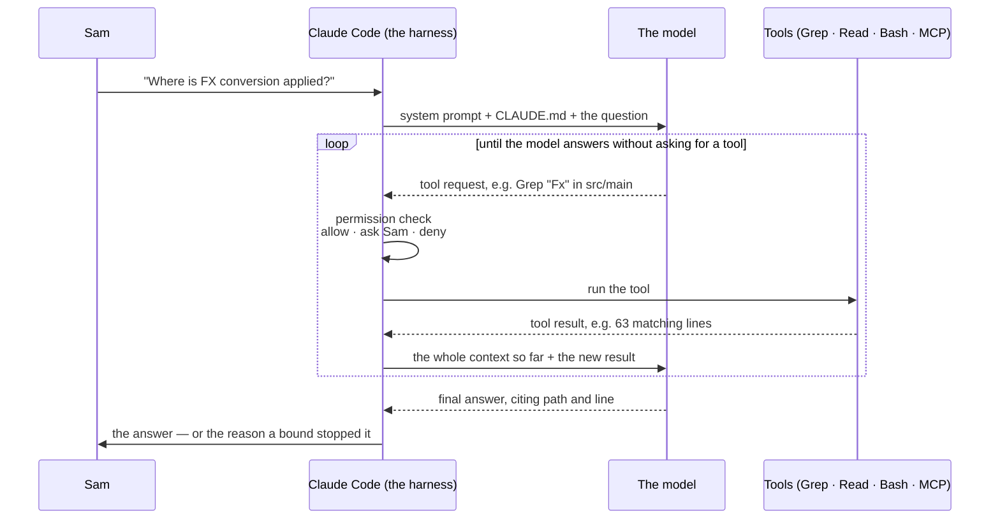

You've been told Claude Code "reads your codebase." It doesn't, and the difference is the whole subject of this page. What it does is run a loop: send the model what it knows so far, let the model ask to *look at* or *do* something, do it, feed the result back, and repeat until the model says it's done or a bound stops it. Every good and bad thing that happens in a session — the class it found in four seconds, the class it invented in four seconds — is that loop doing exactly what it was built to do. Understand the loop and you can predict both.

The example throughout is Sam's first question on Monday: *where is FX conversion applied to a settlement amount?* Sam is in a clone of `ledger-core`, 410,000 lines of Java that nobody has read end to end.

## The loop

Two things are involved, and it helps to keep them apart. **Claude Code** is a program on your laptop (or on a CI runner): it assembles the context, calls the model over the API, and runs tools on the model's behalf. **The model** is Claude itself, behind the API. It sees only what it's sent and replies with text — and, when it wants something, a structured request to use a tool. The model never touches your disk. Claude Code does, on the model's say-so, subject to your rules.

Each pass around the loop is a **turn**, and the loop looks like this:



Reading the arrows in order: your prompt arrives; Claude Code builds the first context — its own system prompt (which includes the definition of every tool the model may ask for), the `CLAUDE.md` files it found, and your message — and sends it. The model replies either with text or with a tool request: a tool name and arguments, such as *Grep for `Fx` under `src/main`*. Claude Code checks that request against your permission rules, runs it if allowed, appends the result to the context, and sends the *whole thing* back to the model. That's one turn. The loop ends when the model replies without asking for a tool, or when a bound you set stops it: a turn cap, a cost ceiling, or the runner's timeout.

Here is what the loop actually did with Sam's question, reconstructed from the session:

```text
turn 1  model → Grep "Fx|FX" in src/main/java                     → 63 lines in 9 files
turn 2  model → Grep "class FxApplier|\.apply\("                   → FxApplier.java:88, SettlementCalculator.java:142
turn 3  model → Read src/main/java/com/ledger/core/fx/FxApplier.java              (lines 60–120)
turn 4  model → Read src/main/java/com/ledger/core/settle/SettlementCalculator.java (lines 120–160)
turn 5  model → Grep "LEDGER.FX.RATES" in src/ and config/         → no matches
turn 6  model → final answer: four citations, one thing labelled as inference
```

Notice what didn't happen. The model didn't read 410,000 lines; it searched, narrowed, and read about a hundred. It chose what to look at based on what it had already seen — turn 2's search terms came from turn 1's results. And when it couldn't find the queue name in this repository, it said so rather than producing one. That last behaviour is not the default; it's a rule you'll write in a minute.

The same loop runs without a keyboard, which is the cheapest way to see it in numbers — Sam's question, non-interactive, limited to searching and reading, saved as JSON:

```bash
# seat: team
cd ~/ledger/ledger-core
claude -p "Where is FX conversion applied to a settlement amount? Search first, then cite path:line for every claim. If you cannot find something, say so." \
  --permission-mode dontAsk \
  --allowedTools "Read,Grep,Glob" \
  --max-turns 15 \
  --output-format json > fx.json
jq '{num_turns, total_cost_usd, is_error, denials: (.permission_denials | length)}' fx.json
jq -r '.result' fx.json
```

```console
$ jq '{num_turns, total_cost_usd, is_error, denials: (.permission_denials | length)}' fx.json
{
  "num_turns": 6,
  "total_cost_usd": 0.09,
  "is_error": false,
  "denials": 0
}
$ jq -r '.result' fx.json
FX conversion is applied in FxApplier.apply() (src/main/java/com/ledger/core/fx/FxApplier.java:88),
called from SettlementCalculator.settle() (src/main/java/com/ledger/core/settle/SettlementCalculator.java:142).
The rate comes from FxRateCache (src/main/java/com/ledger/core/fx/FxRateCache.java:31), which an MQ
listener populates. The queue name is not in this repository — likely ledger-mq-bridge (inference, unverified).
```

`num_turns` is the six passes in the trace above. `denials` is zero because the model asked only for tools on the allowlist; had it asked to run a command, `--permission-mode dontAsk` would have refused it silently and the refusal would be listed in `permission_denials`. The `result` is the model's final text, and the four `path:line` pointers in it are the reason it's worth reading.

## The context window is the working memory

The **context window** is everything the model can see on a given turn, measured in tokens. It's the model's working memory, and it has two properties that drive most of what goes wrong: it's assembled fresh for every turn from a fixed set of sources, and it's finite.

What enters it, in the order Claude Code adds it:

1. **The system prompt** — Claude Code's own instructions and the tool definitions. You don't write this, though headless mode lets you append to or replace it.
2. **`CLAUDE.md`** — the standing orders for the repo you're in. Several can apply at once (a managed one from the platform team, your personal one, the project's, a gitignored local one), and subdirectory files load when the model reads files there; [CLAUDE.md: The Standing Orders](/toolkit/claude-md/) owns the mechanics. Path-scoped rules under `.claude/rules/` and the first 200 lines of the session's auto-memory file arrive the same way.
3. **The conversation** — your messages and the model's replies, in full.
4. **Every tool result, in full.** The 63 grep lines, the 60 lines of `FxApplier.java`, the 400 lines of test output, a Confluence page fetched over MCP — this is what fills the window: not your prompts, but what the tools bring back.
5. **Skills and subagent summaries** when you invoke them.

What leaves: when the window fills, Claude Code **compacts** — it summarizes the older part of the conversation and continues with the summary in place of the detail. You can trigger this yourself with `/compact`, empty the window with `/clear`, and see how full it is and what's in it with `/context`. And at the end of the session, all of it goes; the next session starts from the files on disk.

**A file on disk is the only memory that survives every session, so anything the model must always know belongs in a file, not in a conversation.** That's why this site treats `CLAUDE.md` and `docs/ARCHITECTURE.md` as the product and the chat as scaffolding.

Windows are large as of September 2026 — the `sonnet` and `opus` aliases resolve to models with a one-million-token window, `haiku` to 200K — and that changes *when* compaction happens, not *whether*. The loop appends everything; a long session with a chatty test suite fills any window. When a session starts contradicting what it said an hour ago, compaction is the first suspect, and [Context Exhausted](/troubleshooting/context-exhausted/) is the page.

## Why it makes things up

The model produces the most plausible continuation of its context. When the answer is in the window, the plausible continuation *is* the answer. When it isn't, the plausible continuation is what an answer would look like: a class named the way this codebase names classes, in a package where it would sensibly live. The tone is identical, the confidence is identical, and the second one is a lie the model doesn't know it's telling.

Here is the same question, asked by Sam in `ledger-api` (where new hires start, and where FX conversion doesn't live), answered two ways:

```text
INVENTED   FX conversion is applied by FxConversionService.convert() in the service layer,
           which reads the rate from the settlement request and applies it before persistence.

NOT FOUND  No FX conversion code in ledger-api. Grep for "Fx|FX|exchangeRate" under src/main
           returned only src/main/java/com/ledger/api/dto/SettlementView.java:41 — a read-only
           fxRate field on a response DTO. Conversion is likely in ledger-core (not verified here).
```

The first has no citation because there's nothing to cite; `FxConversionService` doesn't exist. The second has one citation, one honest negative, and one labelled inference. Sam can act on the second in thirty seconds — open a session in `ledger-core` — and would have spent an afternoon on the first.

You make the second one the default with a rule in `CLAUDE.md`. This is the site's standard template, excerpted (the whole file is on the [Day-1 Checklist](/start/day-1-checklist/)):

```markdown
# CLAUDE.md (excerpt — the two rules that make "not found" the default)
## How to work here
# …
- When asked where something happens: search first (Grep/Glob), then cite
  `path:line`. If you cannot find it, say "not found in this repo — may be in
  ledger-core" rather than guessing.

## What not to do
# …
- Do not invent class, method, table, queue, or endpoint names. "Unknown" is an
  acceptable answer; a plausible-sounding name is not.
```

Why a rule in a file works where "please be accurate" in a prompt doesn't: it gives the model a plausible continuation for the case where it finds nothing — a specific sentence it has been told is acceptable — so the plausible thing to say is no longer an invented name. It sits in the context on every turn of every session in the repo, which a prompt doesn't.

The check you apply to every answer, from the model or from a generated document, is mechanical: **is there a `path:line`, and does the line say what the sentence says?** No pointer means inference, and inference gets labelled or verified before anyone acts on it. That rule runs through the whole site — it's the third of the [Three Levers](/start/the-three-levers/) — and [It Made Things Up](/troubleshooting/it-made-things-up/) is the page for when you didn't apply it in time.

## Tokens and the cost shape

A **token** is the unit text is metered in: roughly three-quarters of an English word, or a few characters of code. Both the context window and the bill are counted in tokens, and the loop determines the shape of the bill. Because every turn re-sends the whole context, a session's cost is roughly *turns × what's in the window*, not *the length of your prompts*. Two mechanisms keep that affordable: the model only reads what the tools fetched, and prompt caching (on by default as of September 2026) bills a repeated prefix — the system prompt, `CLAUDE.md`, the earlier turns — at a fraction of the input rate.

So the arithmetic has four terms, and the site teaches it with placeholders because the rates change and the [costs page](https://code.claude.com/docs/en/costs) is the source of truth:

```text
cost ≈ (fresh input tokens      × input rate)
     + (output tokens           × output rate)          ← the model's replies and tool requests
     + (cache-write tokens      × cache-write rate)     ← the first time a prefix is sent
     + (cache-read tokens       × cache-read rate)      ← every later turn; a fraction of input
```

A representative `usage` block from a `-p` run makes the shape visible:

```json
{
  "input_tokens": 1200,
  "output_tokens": 5300,
  "cache_creation_input_tokens": 50000,
  "cache_read_input_tokens": 940000
}
```

Read it right to left. `cache_read_input_tokens` dominates: the same 50,000-token prefix (written once — `cache_creation_input_tokens`) was re-read on every turn, which is exactly what the loop does. `output_tokens` is what the model wrote. `input_tokens` is the genuinely new material. The lesson is that a session's cost grows with its turn count, which is why `--max-turns` is a cost bound and not just a safety bound.

And the 410,000-line repo? Call it forty characters a line and a few characters a token: on the order of sixteen million characters, millions of tokens, several times any window that exists as of September 2026. **A large repo is never read; it's searched.** The repo-mapping skill on this site says so as a rule: *search, don't read — use Grep and Glob to find things; read only the files you cite.* A map of `ledger-core` reads perhaps a twentieth of it, and that's the difference between a job that costs pocket change and one that fails.

Don't estimate what you can measure. Interactively, `/cost` shows the session's spend; headless, `total_cost_usd` is in the JSON. The per-job arithmetic lives in [Cost and Governance](/overnight-qa/cost-and-governance/), the model aliases and caching in [Enterprise Setup, Models, and Cost Arithmetic](/toolkit/enterprise-and-cost/).

:::tip[Good citizen]
An interactive session that loops costs you your own attention; you notice and stop it. An unattended one costs the team's budget by 06:00, and a *cheap* loop — a tool call that fails the same way every turn — can run for hundreds of turns under a modest `--max-budget-usd`. Every unattended job on this site carries a turn cap *and* a budget *and* a timeout, because each catches what the others miss.
:::

## What a tool call is, and why permissions exist

A **tool** is something the model can ask Claude Code to do: `Read` a file, `Grep` or `Glob` the tree, `Edit` or `Write` a file, run a shell command with `Bash`, `WebFetch` a URL, or call a tool that an MCP server exposes (Confluence search, a browser click). A **tool call** is the model's request — a name and arguments, as text — and it does nothing by itself. Claude Code decides whether to honour it.

That decision is where permissions live, and it's the only place a safety property can be structural. The model can be *asked* not to delete tests; Claude Code can be *configured* so that the request is refused. The configuration has three layers, each with one sentence here and a page elsewhere:

- The **permission mode** sets the default for tools nobody has written a rule about. As of September 2026 the modes are `default` (ask you), `acceptEdits` (file edits go through, commands ask), `plan` (read-only exploration), `auto` (a classifier reviews each call), `dontAsk` (deny anything not explicitly allowed — the CI setting), `bypassPermissions` (never on a runner), and `manual`. [Running Claude Unattended](/overnight-qa/running-unattended/) is the page for choosing one.
- **Allow and deny rules** in `.claude/settings.json` name tools and patterns — `Bash(./mvnw *)` allowed, `Bash(rm -rf *)` denied, `Read(./.env)` denied — and the [Day-1 Checklist](/start/day-1-checklist/) gives you the baseline.
- **Hooks** are scripts that run at a lifecycle event — before a tool call, after it, on stop — and can block or rewrite it with a reason; [Hooks](/toolkit/hooks/) owns the JSON.

Interactively, a call the rules don't settle becomes a prompt on your screen. In headless mode there's no screen: a tool that isn't pre-approved is denied automatically, and every denial is recorded in the JSON's `permission_denials` so you can see what the model wanted and didn't get.

:::caution[The request is not the fence]
"Do not delete tests" in a prompt is a request. `"deny": ["Bash(rm *)"]` and a hook that refuses writes outside `src/test/` are fences. Interactively, you are the fence; at 02:17, nobody is. The Field Note [The Night the Agent Fixed the Test by Deleting It](/blog/the-night-the-agent-fixed-the-test-by-deleting-it/) is what a request is worth.
:::

## Headless mode: the same loop with no human at the keyboard

`claude -p "…"` runs the loop once, non-interactively, and exits. Nothing else changes: same context assembly, same tool calls, same permission check. What changes is that every decision the keyboard would have made — *may it run this? how long should it go on? how much may it spend? what should it produce?* — has to be made in advance, as flags: `--permission-mode` and `--allowedTools` for the first, `--max-turns` for the second, `--max-budget-usd` for the third, `--output-format json` (optionally with `--json-schema`) for the fourth. `--bare` skips loading `CLAUDE.md`, hooks, and skills, which is right for a quick credential check and wrong for a job that depends on the standing orders.

The run reports how it ended with an exit code — `0` success, `1` failure, `2` partial (the cost ceiling was hit, or authentication failed before the first turn) — and the JSON carries `result`, `num_turns`, `total_cost_usd`, `usage`, `is_error`, `duration_ms`, and `permission_denials`: the night shift's evidence. [Headless Mode and the Agent SDK](/toolkit/headless-and-sdk/) is the flag reference; [Running Claude Unattended](/overnight-qa/running-unattended/) reads the JSON field by field and turns the exit codes into a table of what to do.

## Subagents

A **subagent** is a delegated worker with its own fresh context window: the main session hands it one job ("map the entry points of `ledger-batch`"), it runs its own loop with its own tool calls, and it returns a summary — not its transcript — to the session that spawned it. That's how twenty-three repos fit: the parent sees twenty-three summaries, never twenty-three repos' worth of grep output. Claude Code ships built-in subagents (`Explore`, `Plan`, `general-purpose`) and lets you define your own in `.claude/agents/`, each with its own tool list and model; [Subagents: Delegation With a Fresh Context](/toolkit/subagents/) has the file format, and [Mapping the System](/kt/mapping-the-system/) is the recipe that fans out with them. The trade: each subagent pays for its own context, and the parent only knows what the summary says.

## Where this differs from chat

In a chat window, *you* are the retrieval system: you decide which file to paste, and the model reasons over exactly that. In Claude Code the loop is the retrieval system, and the model decides what to fetch based on what it has already seen. That's what makes it useful on a codebase nobody can paste, and why the standing orders and permission rules matter more than the wording of any one prompt. A chat can only be wrong. An agent can be wrong *and* act on it, at your permission level, for as many turns as you allow.

One habit follows: when the output surprises you, ask what it could see before you form a theory about the model — and when it gives you an answer, look for the pointer.

## Where next

- **Next in the journey:** [The Three Levers](/start/the-three-levers/) — context, tools, proof: the model for any technique on this site and the diagnostic for any that failed. This page explained how the machine works; that one explains how to think about anything you put on it.
- **The lateral jump:** if you'd rather see the loop do a real job first, [The 90-Minute Repo Map](/kt/quick-start/) runs it against `ledger-api` and ends with an expert's stamp.
