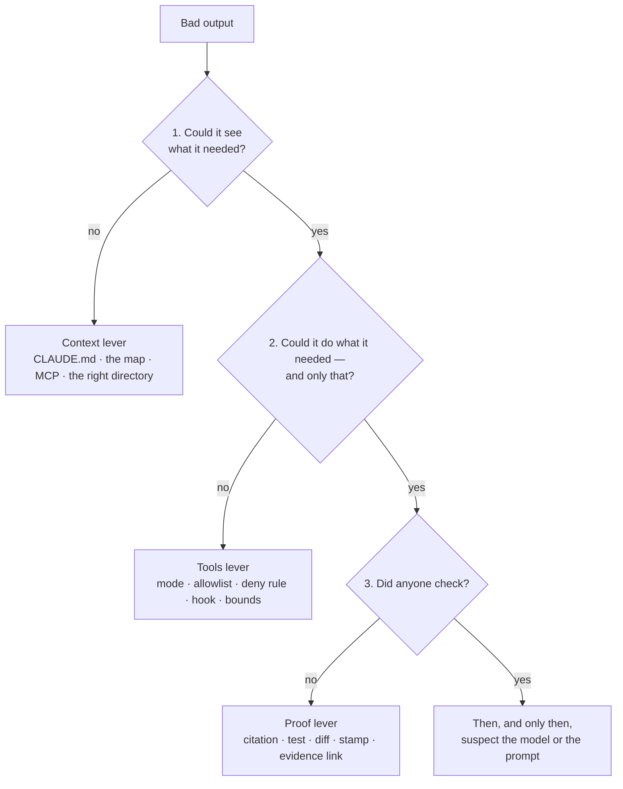

Every technique on this site pulls one of three levers, and every failure is one of them left unpulled. That's the whole model. It fits a `CLAUDE.md`, a hook, an expert's PR approval, a mutation-testing gate, and a browser agent clicking through staging, and it fits them the same way a year from now when the flags have changed names. Learn it here once; the rest of the site uses it without re-explaining it.

## The model

**Context — what the model can see.** The repo the session is in, the `CLAUDE.md` standing orders, the files it has read this session, the Confluence page fetched over MCP, the test output piped in. The model reasons only over what's in the window, and most "it made that up" incidents are context failures wearing a confident face.

**Tools — what the model can do, and is allowed to do.** Read, search, run a command, edit a file, call an MCP server, open a browser. Permission modes, allow and deny rules, and hooks draw the line between *can* and *may*. Most "it did something scary" incidents are tools with no line drawn.

**Proof — how you'll know it was right.** A citation to `path:line`, a test that runs, a diff a human reads, an expert's stamp on a document, a screenshot in the report. Most "we trusted it and it was wrong" incidents are a missing proof step, not a bad model.

Two things make this more than a slogan. The levers are independent: a session can see everything, be allowed nothing, and still be wrong; or see nothing, be allowed everything, and be dangerous — and fixing the wrong one is the most common waste of an afternoon. And they're ordered: context is cheapest to check and most often the cause, proof is the one you can add after the fact, so the diagnostic below always asks them in the same order.

## Context: what the model can see

The failure it prevents is the invented name — `FxConversionService`, a table called `FX_RATE_HISTORY`, an endpoint that would exist if the codebase were tidier — and its quieter cousin, the right answer about the wrong repo. Both come from the same place: the model was asked a question whose answer wasn't in the window, and the most plausible continuation of the window was a plausible-sounding answer ([the mechanism](/start/how-agentic-coding-works/#why-it-makes-things-up)). The lever is what you do about it.

You pull it by putting the right things where the loop will find them. The standing orders in `CLAUDE.md` ([the Toolkit page](/toolkit/claude-md/)) are the always-loaded part: what this repo is, how to work here, what not to do — and, crucially, that "not found" is an acceptable answer. A stamped `docs/ARCHITECTURE.md` imported from it is the map. An MCP server ([MCP](/toolkit/mcp/)) is how a Confluence page or a GitHub issue gets in. Subagents ([Subagents](/toolkit/subagents/)) are how twenty-three repos fit — each in its own window, summaries back to the parent. And the search-don't-read rule is how a 410,000-line repo fits at all.

The recipe that pulls it hardest is [Mapping One Repo](/kt/mapping-a-repo/): a skill that produces the map with every claim cited, and a `CLAUDE.md` that loads it into every future session. [The First Two Weeks](/kt/onboarding-track/) is the same lever pointed at Sam: a session loaded with the stamped map and told to cite or say "not in the map — ask a human."

## Tools: what the model can do, and may do

The failure it prevents is the action you didn't want: a force-push, a `rm -rf` on the wrong directory, a test deleted because deleting it was the shortest path to green, a `DROP TABLE` in a script the model was "just testing", a POST to somewhere other than the report endpoint. None of these needs a malicious model. They need a model with a goal, a tool that would achieve it, and no line between *can* and *may*.

You pull it structurally or not at all. A permission mode sets the default; `--permission-mode dontAsk` plus an explicit `--allowedTools` list is the locked-down shape for anything unattended, because everything not on the list is refused without a prompt. Deny rules in `.claude/settings.json` name the things that are never acceptable regardless of mode. Hooks ([Hooks](/toolkit/hooks/)) run a script before the tool call and can refuse it with a reason. And the bounds — `--max-turns`, `--max-budget-usd`, the runner's `timeout-minutes` — are tools-lever settings too: they limit not *what* the model may do but *how much*. [Headless Mode and the Agent SDK](/toolkit/headless-and-sdk/) is the flag reference.

The recipe is [Running Claude Unattended](/overnight-qa/running-unattended/), which chooses the mode and the bounds per job, and [Blast Radius](/overnight-qa/blast-radius/), which lists what the night may never do and names the flag, setting, hook, or workflow permission that enforces each line. The one word to hold onto: **a sentence in the prompt is a request; a deny rule is a fence.**

## Proof: how you'll know it was right

The failure it prevents is the confidently wrong artifact that passed review because it *read* well. The architecture document that described the 2019 settlement flow. The generated test that asserts the bug is correct. The morning report whose "settlement module appears fragile" sent a human to do the work the agent was supposed to have done. In each case the model could see enough and was allowed enough; what was missing was a step where someone — or something — checked.

You pull it by deciding, before the model runs, what evidence would prove the output right, and then requiring that evidence in the output. On this site that means five things: a `path:line` citation on every generated claim, so an expert reviews evidence rather than prose; an expert's stamp as a git event (a PR approval that flips `kt:draft` to `kt:stamped`), not a feeling; a test that runs — three times for the night's generated tests, plus a mutation score to show it kills something; a diff a human reads, because the workflow opens the PR, never the agent; and an evidence link on every morning-report finding, or the finding is labelled `(inference)`. The Toolkit's contribution is small and mechanical: `--json-schema` in [Headless Mode and the Agent SDK](/toolkit/headless-and-sdk/) makes the report's shape enforceable, so a finding without an evidence field is a schema error, not a judgement call.

The recipes: [the review gate](/kt/mapping-a-repo/#the-review-gate) for generated documents, [Characterization Tests](/overnight-qa/characterization-tests/) for the flake gate and mutation testing, [The Morning Report](/overnight-qa/the-morning-report/) for the evidence rule, and [Keeping It True](/kt/living-docs/) for the nightly job that checks every citation still resolves.

## The techniques and the levers they pull

Every technique on the site, placed. A filled circle is the lever the technique exists to pull; an open one is a lever it also touches, which is usually where its failure mode hides.

| Technique | Context | Tools | Proof | Where it's taught |
|---|:-:|:-:|:-:|---|
| `CLAUDE.md` — the standing orders | ● | ○ | | [CLAUDE.md](/toolkit/claude-md/) — the "what not to do" section is a request; pair it with a deny rule |
| The repo map with `path:line` citations | ● | | ● | [Mapping One Repo](/kt/mapping-a-repo/) |
| The expert stamp (PR approval → `kt:stamped`) | | | ● | [The review gate](/kt/mapping-a-repo/#the-review-gate) |
| `--permission-mode dontAsk` + an `--allowedTools` allowlist | | ● | | [Running Claude Unattended](/overnight-qa/running-unattended/) |
| Hooks (`block-destructive.sh`, `write-scope.sh`) | | ● | | [Hooks](/toolkit/hooks/) · [Blast Radius](/overnight-qa/blast-radius/) |
| `--max-budget-usd` / `--max-turns` | | ● | | [Running Claude Unattended](/overnight-qa/running-unattended/) · [Cost and Governance](/overnight-qa/cost-and-governance/) |
| MCP to Confluence | ● | ○ | | [Confluence](/kt/confluence/) · [MCP](/toolkit/mcp/) — a server is also a tool; allowlist it and honour `restricted` |
| Subagents per repo | ● | ○ | | [Mapping the System](/kt/mapping-the-system/) · [Subagents](/toolkit/subagents/) — each gets its own tool list |
| Characterization tests | | | ● | [Characterization Tests](/overnight-qa/characterization-tests/) |
| The morning report's evidence rule | | | ● | [The Morning Report](/overnight-qa/the-morning-report/) |
| Mutation testing as the quality gate | | | ● | [Characterization Tests](/overnight-qa/characterization-tests/) |

Two patterns are worth seeing. The knowledge-transfer playbook lives in the first and third columns — get the right things in front of the model, check what comes out. The overnight playbook lives in the second and third — fence what runs unattended, leave evidence. Nothing on the site pulls context or tools without a proof step nearby, and that's deliberate.

## Which lever failed

When output is bad, ask the three questions in order and stop at the first "no." A tools or proof fix applied to a context failure changes nothing, which is why the order matters.



**1. Could it see what it needed?** Inside a session, `/context` shows what's loaded and how full the window is. From the shell, the two most common context failures — the session is in the wrong directory, or the file you think it loaded doesn't exist there — take one command to rule out:

```bash
# seat: team
pwd                                        # which repo is the session actually in?
ls CLAUDE.md docs/ARCHITECTURE.md 2>&1     # do the files you think it loaded exist here?
```

```console
$ pwd
/home/sam/ledger/ledger-api
$ ls CLAUDE.md docs/ARCHITECTURE.md 2>&1
CLAUDE.md
ls: cannot access 'docs/ARCHITECTURE.md': No such file or directory
```

The second line is the answer: the map the `CLAUDE.md` imports isn't in this checkout, so the model never saw it, and every answer it gave about the architecture was inference. If the files are there and the window is half full of test output, it's compaction — [Context Exhausted](/troubleshooting/context-exhausted/). If it's the right files in the wrong repo — [Wrong Repo, Wrong Branch, Wrong File](/troubleshooting/wrong-target/).

**2. Could it do what it needed — and only that?** For an unattended run, the JSON answers both halves. A denial count above zero means the model wanted a tool it wasn't given — which is either the fence working or the allowlist too tight; the reason string tells you which:

```bash
# seat: team
jq '.permission_denials | length' night.json
grep -o 'blocked by policy[^"]*' night.json      # the hooks' reasons, whatever the entry format
```

```console
$ jq '.permission_denials | length' night.json
1
$ grep -o 'blocked by policy[^"]*' night.json
blocked by policy (.claude/hooks/write-scope.sh): src/main/java/com/ledger/shared/MoneyMath.java
```

That's the fence working: the characterization job tried to write under `src/main/`, the hook refused it, and the reason is in the evidence. A denial with no hook reason is the allowlist — check `.claude/settings.json` and the workflow's `--allowedTools`. A run with *zero* denials that did something it shouldn't have is the dangerous case: it was allowed, and a deny rule or hook doesn't exist yet — [Blast Radius](/overnight-qa/blast-radius/) has the table of which one.

**3. Did anyone check?** The question is *where's the evidence?* For a generated document, the cheap structural check is that every citation still points at a real line:

```bash
# seat: team
scripts/check-citations.sh
```

```console
$ scripts/check-citations.sh
LINE GONE      src/main/java/com/ledger/core/fx/FxApplier.java:88 (file now has 71 lines)

1 stale citation(s)
```

For a morning report, it's that every cause group has an evidence line — the report template makes that a count you can compare:

```bash
# seat: team
grep -c '^### ' report.md          # cause groups in the report
grep -c '^- evidence:' report.md   # evidence lines — must be the same number
```

```console
$ grep -c '^### ' report.md
3
$ grep -c '^- evidence:' report.md
3
```

If the counts match, the citations resolve, and the answer is still wrong, you've reached the last box in the diagram: now — and only now — reread the prompt, consider the model, and ask whether the question was answerable from the code at all. [Troubleshooting: Which Lever Failed?](/troubleshooting/overview/) runs the same three questions from the symptom's side.

## Three incidents, three levers

Each of these happened to the cast, and each is one lever left unpulled. The instinct in all three was to blame the model or rewrite the prompt; the fix in all three was a file.

**Sam's FX question — context.** Monday, `ledger-api`, first session. Sam asks where FX conversion is applied. The session greps `ledger-api`, finds an `fxRate` field on a response DTO, and — with nothing else in the window — narrates a conversion step in the service layer that doesn't exist. The model could do everything it needed; nobody had checked yet because Sam didn't know what a check looked like. But the first question fails: it couldn't see that conversion lives in `ledger-core`, because nothing in the window said so. The fix is the standing orders in `CLAUDE.md` — "if you cannot find it, say *not found in this repo — may be in ledger-core*" — and the imported map whose Integrations section points next door. With those loaded, the same question gets a citation to `FxApplier.java:88` in the right repo, and Sam's tutor session in [The First Two Weeks](/kt/onboarding-track/) is built on exactly that behaviour. Rewriting the prompt would have produced a more politely worded invention.

**The night deleted a test — tools.** The characterization job on `ledger-shared` wrote tests to pin `MoneyMath`'s current rounding. One failed on the second run, and the shortest path to a green suite was to remove a test — in the Field Note's version, an existing one. The skill said "never modify or delete an existing test." It was a request. The second question fails: it could do more than it should have. The fixes are structural and they stack: the writing job's settings deny `Bash(rm *)` and every `git` write; the write-scope hook refuses any `Edit` or `Write` outside `src/test/` with a reason that lands in `permission_denials`; and the workflow, not the agent, commits and opens the draft PR, so the agent never holds the power to push. What the tools lever *can't* reach — an edit that guts an existing test inside the fence — is proof's job: the PR diff shows the deletion, the morning's review checklist asks about it, and the mutation score drops. [The Night the Agent Fixed the Test by Deleting It](/blog/the-night-the-agent-fixed-the-test-by-deleting-it/) is the write-up; [Blast Radius](/overnight-qa/blast-radius/) is the page that would have prevented it.

**The 2019 Settlement Flow page — proof.** The Confluence page everyone links, fetched over MCP into a session mapping `ledger-batch`. It's fluent, detailed, and has described a flow that doesn't exist since the 2022 MQ rework. The model could see it — that was the problem — and it was allowed only to read. The generated `ARCHITECTURE.md` reproduced the page's flow and passed review because it read like something Priya would have written. The third question fails: nobody checked, because there was nothing checkable — no pointer into the code. The fix is the citation rule (every claim cites `path:line` into the code, never into a document; a claim sourced only to Confluence goes under "Unverified"), the stamp (Priya reads the citations, not the prose, and her PR approval is the event that makes the doc true), and the nightly freshness job that says when a cited line moves. [The Architecture Doc That Was Confidently Wrong](/blog/the-architecture-doc-that-was-confidently-wrong/) is the write-up; [Confluence: Mining a Graveyard for the Living](/kt/confluence/) treats every Confluence page as undated until the code confirms it.

## Using the levers to design a recipe

The diagnostic runs backwards, too. Before you adopt any technique — from this site or anywhere — write three lines:

```text
Context:  what will be in the window, and what won't (CLAUDE.md? the map? MCP? --bare?)
Tools:    what it may do, in which mode, with which deny rules and hooks, under which bounds
Proof:    what evidence the output must contain, and who checks it, and how long that takes them
```

Two of the site's recipes, written that way. The First Night: context is the surefire reports and `src/` with no `CLAUDE.md` (`--bare` — the standing orders are for people who edit, and this job doesn't); tools are `Read`, `Grep`, `Glob` under `dontAsk`, twenty-five turns, a small budget, a forty-five-minute timeout; proof is a `path:line` for every cause group and a `(verified)` or `(inference)` label on every explanation. The 90-Minute Repo Map: context is the repo and the `map-repo` skill; tools are read, search, write, and the build under `acceptEdits`, sixty turns; proof is a citation on every claim, an "Unverified" section for the rest, and Priya's thirty minutes on the citations, ending in a PR approval.

If you can't fill in the third line, the technique isn't ready — not because the model is untrustworthy, but because you've no way to find out whether it was. **Every recipe on this site names its levers and its proof step, and a recipe that names no proof step is a demo.**

:::tip[Good citizen]
The proof lever costs a human's time, and here that human is usually Priya or Marcus. A proof step that takes an expert two hours has failed even if it finds the error, because they won't do it twice. Design the evidence so the check is fast: citations to read, not prose to judge; a diff, not a description; thirty minutes, not an afternoon. [The citizenship contract](/kt/overview/#the-citizenship-contract) is the long form.
:::

## Where next

- **Next in the journey:** [Working Within Policy: What Can Leave the Building](/start/working-within-policy/) — the context lever has a boundary you don't set: which code and which documents may reach the model at all, and the four asks that get you what you need.
- **The lateral jump:** something is already wrong? [Troubleshooting: Which Lever Failed?](/troubleshooting/overview/) runs the three questions from the symptom's side.
